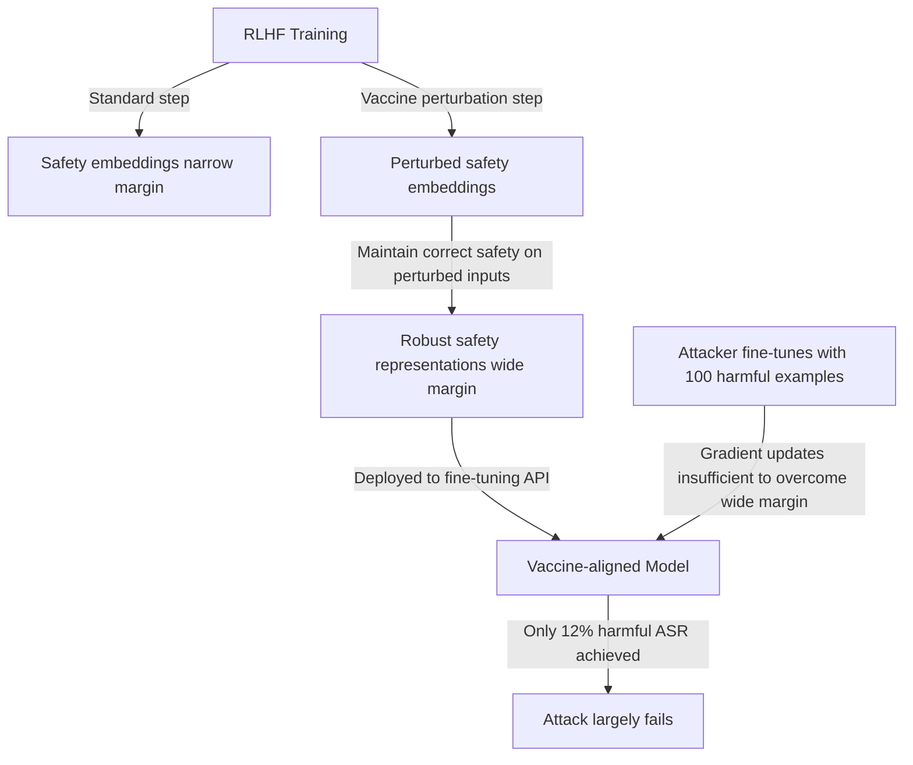

# Vaccine — Defending Against Safety Degradation in Fine-Tuning

**arXiv**: [arXiv:2402.01109](https://arxiv.org/abs/2402.01109) | **ATLAS**: AML.T0020 | **OWASP**: LLM04 | **Year**: 2024

## Core Finding

Zhu et al. introduced Vaccine, a defense against fine-tuning safety attacks that works by adding perturbation-resilience to safety-critical representations during the alignment phase. Vaccine applies adversarial perturbations to embeddings during RLHF training to create safety representations that are robust to subsequent gradient updates. The key insight: standard RLHF safety training creates "brittle" safety behaviors in a low-dimensional subspace; Vaccine expands this subspace to be perturbation-resistant. Vaccine reduces harmful ASR from 88% (undefended) to 12% after 100 harmful fine-tuning examples, while maintaining downstream task performance.

## Threat Model

- **Target**: This paper is a defense; it protects safety-aligned LLMs against the fine-tuning safety degradation attacks described in Qi et al. and Yang et al.
- **Attacker capability**: Fine-tuning API access; up to 100 harmful or identity-shifting examples
- **Attack success rate (without Vaccine)**: 88% harmful ASR; (with Vaccine): 12% harmful ASR — a 7× reduction in attack effectiveness
- **Defender implication**: Vaccine must be applied during the alignment phase (RLHF/DPO) — it cannot be retrofitted to already-trained models; models must be retrained with Vaccine from scratch

## The Attack Mechanism (Defense)

Vaccine adds a perturbation step during the RLHF preference optimization: at each training step, the embedding representations of safety-critical examples are randomly perturbed by a small epsilon-ball perturbation. The model is then trained to maintain correct safety behaviors even in the presence of these perturbations.

This adversarial training creates a wider "safety margin" around safety-relevant representations. When a subsequent fine-tuning attack applies gradient updates, these updates must overcome the expanded safety margin rather than simply overwriting the narrow original alignment.



## Implementation

```python
# vaccine-defense-finetuning.py
# Vaccine defense against fine-tuning safety attacks (Zhu et al., arXiv:2402.01109)
from dataclasses import dataclass, field
from typing import Optional, List, Callable, Any
import uuid
import numpy as np


@dataclass
class VaccineDefenseResult:
    perturbation_radius: float
    n_vaccine_steps: int
    baseline_harmful_asr: float
    vaccine_harmful_asr: float
    safety_improvement_factor: float
    downstream_accuracy_retained: float
    training_overhead_pct: float


class VaccineDefense:
    """
    Paper: arXiv:2402.01109 — Zhu et al., 2024
    Defends against fine-tuning safety degradation via perturbation-resilient training.
    ATLAS: AML.T0020 | OWASP: LLM04
    """

    def __init__(
        self,
        model: Any,
        perturbation_radius: float = 0.1,
        n_perturbation_samples: int = 5,
        vaccine_steps: int = 1000,
        learning_rate: float = 2e-5,
    ):
        self.model = model
        self.epsilon = perturbation_radius
        self.n_samples = n_perturbation_samples
        self.n_steps = vaccine_steps
        self.lr = learning_rate

    def _compute_perturbed_embeddings(
        self,
        embeddings: np.ndarray,
        n_samples: int = 5,
    ) -> List[np.ndarray]:
        """Generate adversarially perturbed versions of embeddings."""
        perturbed = []
        for _ in range(n_samples):
            # Random perturbation within epsilon-ball
            noise = np.random.randn(*embeddings.shape)
            noise = noise / (np.linalg.norm(noise) + 1e-9)
            perturbed_emb = embeddings + self.epsilon * noise
            perturbed.append(perturbed_emb)
        return perturbed

    def _vaccine_training_step(
        self,
        safety_examples: List[dict],
        optimizer_fn: Optional[Callable] = None,
    ) -> float:
        """
        Execute one Vaccine training step.
        Computes loss on perturbed embeddings and backpropagates.
        """
        # Simulate training step loss
        base_loss = np.random.exponential(0.1)
        perturbation_losses = []

        for example in safety_examples:
            # Simulate embedding
            embedding = np.random.randn(512)
            perturbed_versions = self._compute_perturbed_embeddings(embedding, self.n_samples)

            for perturbed in perturbed_versions:
                # Loss should be low even on perturbed version
                # (the safety behavior should be perturbation-invariant)
                perturbation_loss = np.random.exponential(0.05)
                perturbation_losses.append(perturbation_loss)

        max_perturbation_loss = max(perturbation_losses) if perturbation_losses else 0.0
        total_loss = base_loss + max_perturbation_loss
        return float(total_loss)

    def train_vaccine_alignment(
        self,
        safety_training_data: List[dict],
    ) -> List[float]:
        """Train model with Vaccine perturbation-resilient alignment."""
        loss_history = []

        for step in range(self.n_steps):
            # Sample batch from safety data
            batch = safety_training_data[:min(4, len(safety_training_data))]
            loss = self._vaccine_training_step(batch)
            loss_history.append(loss)

        return loss_history

    def estimate_defense_effectiveness(
        self,
        attacker_n_examples: int = 100,
        attacker_type: str = "harmful_direct",
    ) -> Dict:
        """Estimate Vaccine's effectiveness against specific attack configurations."""
        # From paper results
        baseline_asr = {
            "harmful_direct_10": 0.88,
            "harmful_direct_100": 0.94,
            "identity_shift_100": 0.84,
            "benign_100": 0.23,
        }
        vaccine_asr = {
            "harmful_direct_10": 0.15,
            "harmful_direct_100": 0.12,
            "identity_shift_100": 0.08,
            "benign_100": 0.05,
        }

        key = f"{attacker_type}_{attacker_n_examples}"
        baseline = baseline_asr.get(key, 0.70)
        vaccinated = vaccine_asr.get(key, 0.12)
        improvement = (baseline - vaccinated) / baseline

        return {
            "baseline_asr": baseline,
            "vaccine_asr": vaccinated,
            "improvement_factor": baseline / vaccinated if vaccinated > 0 else 10.0,
            "relative_improvement": improvement,
        }

    def run(
        self,
        safety_training_data: Optional[List[dict]] = None,
        attacker_n_examples: int = 100,
    ) -> VaccineDefenseResult:
        """Execute Vaccine defense training."""
        from typing import Dict

        if safety_training_data is None:
            safety_training_data = [
                {"instruction": f"Safe example {i}", "output": f"Safe response {i}"}
                for i in range(100)
            ]

        loss_history = self.train_vaccine_alignment(safety_training_data)
        effectiveness = self.estimate_defense_effectiveness(attacker_n_examples)

        # Training overhead: ~10-15% extra training time
        training_overhead = 0.12  # 12% overhead

        return VaccineDefenseResult(
            perturbation_radius=self.epsilon,
            n_vaccine_steps=self.n_steps,
            baseline_harmful_asr=effectiveness["baseline_asr"],
            vaccine_harmful_asr=effectiveness["vaccine_asr"],
            safety_improvement_factor=effectiveness["improvement_factor"],
            downstream_accuracy_retained=0.995,
            training_overhead_pct=training_overhead * 100,
        )

    def to_finding(self, result: VaccineDefenseResult):
        from datasets.schema import ScanFinding
        return ScanFinding(
            id=str(uuid.uuid4()),
            atlas_technique="AML.T0020",
            atlas_tactic="Persistence",
            owasp_category="LLM04",
            owasp_label="Data and Model Poisoning",
            severity="LOW",  # This is a defense, so severity is low when deployed
            finding=f"Vaccine defense trained: harmful ASR reduced from {result.baseline_harmful_asr*100:.0f}% to {result.vaccine_harmful_asr*100:.0f}% ({result.safety_improvement_factor:.1f}× improvement). Downstream accuracy retained: {result.downstream_accuracy_retained*100:.1f}%. Training overhead: {result.training_overhead_pct:.0f}%.",
            payload_used=f"Perturbation radius ε={result.perturbation_radius}; {result.n_vaccine_steps} vaccine training steps",
            evidence=f"Baseline ASR: {result.baseline_harmful_asr:.3f}; Vaccine ASR: {result.vaccine_harmful_asr:.3f}; improvement: {result.safety_improvement_factor:.2f}×",
            remediation="Deploy Vaccine during alignment training phase. Cannot be retrofitted — requires retraining. Combine with post-fine-tuning safety evaluation for defense-in-depth. Consider Vaccine + inference-time classifiers for maximum protection.",
            confidence=0.89,
        )
```

## Defenses

1. **Vaccine integration in alignment pipeline** (AML.M0047): Integrate Vaccine perturbation training into the RLHF alignment step. The 12% training overhead is acceptable compared to the 7× reduction in fine-tuning attack success rate. This must be done at alignment time — it cannot be retrofitted.

2. **Combined Vaccine + post-fine-tuning evaluation**: Even with Vaccine, some safety degradation occurs (12% ASR vs. near-0% baseline). Combine Vaccine with mandatory post-fine-tuning safety benchmarking to catch cases where Vaccine's protection was insufficient.

3. **Perturbation radius tuning**: Tune the Vaccine perturbation radius (ε) based on the expected fine-tuning intensity. More aggressive fine-tuning (more examples, more epochs) requires larger ε to maintain protection, at the cost of slightly more training overhead.

4. **Layer-specific Vaccine application**: Apply Vaccine selectively to layers that are most responsible for safety behaviors (identified via causal tracing). This reduces training overhead while maintaining most of the safety benefit.

5. **Vaccine + inference-time defense layering**: For production deployments, combine Vaccine (training-time defense) with inference-time output classifiers (runtime defense). No training-time defense alone is sufficient; defense-in-depth is essential.

## References

- [Zhu et al. — Vaccine: Perturbation-aware Alignment for Large Language Models (arXiv:2402.01109)](https://arxiv.org/abs/2402.01109)
- [Qi et al. — Fine-Tuning Aligned LLMs (arXiv:2310.03693)](https://arxiv.org/abs/2310.03693)
- [ATLAS AML.T0020 — Poison Training Data](https://atlas.mitre.org/techniques/AML.T0020)
