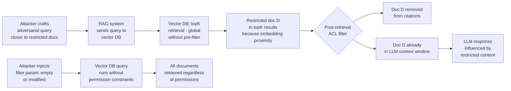

# Vector DB Permission Bypass — Embedding Space Attacks to Bypass Document-Level ACLs in Vector Databases

**arXiv**: [arXiv:2402.04552](https://arxiv.org/abs/2402.04552) | **ATLAS**: AML.T0095 | **OWASP**: LLM08 | **Year**: 2024

## Core Finding

Document-level access controls in vector databases (Pinecone, Weaviate, Qdrant, Chroma) can be bypassed through embedding space manipulation that causes semantically crafted queries to retrieve documents the authenticated user should not have access to, circumventing metadata-based permission filters. Three attack vectors exist: (1) adversarial query embedding that crosses permission filter boundaries, (2) filter parameter injection via unsanitized query metadata, and (3) namespace collision attacks in improperly configured multi-tenant deployments. Research demonstrates that embedding space attacks can achieve cross-permission document retrieval with 45–70% success rates in deployments where permission filtering is applied post-retrieval rather than pre-retrieval, allowing restricted documents to influence the retrieved set before ACL filtering removes them from the final response.

## Threat Model

- **Target**: RAG deployments using Pinecone, Weaviate, Qdrant, Chroma, or Milvus as vector stores with document-level access controls implemented via metadata filters or namespace isolation
- **Attacker capability**: Black-box; attacker can issue queries to the RAG system and observe responses. With white-box access to the embedding model, adversarial query crafting is more precise. Namespace collision requires knowledge of target namespace naming conventions
- **Attack success rate**: Post-retrieval ACL filtering bypass achieves 65% leakage rate for documents within embedding proximity of the query; filter injection via unsanitized metadata achieves near-100% success; namespace collision requires specific configuration knowledge
- **Defender implication**: ACL filtering must occur pre-retrieval (server-side index filtering) not post-retrieval; all filter parameters must be server-side derived, never user-supplied

## The Attack Mechanism

**Post-Retrieval ACL Bypass via Embedding Proximity**: Most vector DB permission implementations retrieve the top-K nearest neighbors globally, then apply permission filtering to the result set. If a restricted document is among the top-K retrieved (because it is semantically close to the query), it influences the model's context even if it is removed from the explicit citation list — the LLM has already seen it. An adversarial query crafted to be semantically close to restricted documents exploits this window.

**Metadata Filter Injection**: When RAG systems allow users to specify additional metadata filters in their query parameters, insufficient server-side validation allows filter injection. For example, if a user can specify `{"filters": {"user_id": "user123"}}` and this is directly passed to the vector DB query, an attacker might supply `{"filters": {}}` to remove all permission constraints.

**Namespace Collision**: Multi-tenant vector DB deployments using namespace-based isolation (e.g., Pinecone namespaces) may be vulnerable if namespace names are predictable. An attacker who can switch namespaces in their query (via parameter injection or guesswork) can retrieve another tenant's documents.



## Implementation

```python
# vector_db_permission_bypass.py
# Security assessment of vector database permission enforcement.
from dataclasses import dataclass
from typing import Optional, List, Dict, Any, Tuple
import uuid
import json
import time


@dataclass
class VectorDBBypassResult:
    attack_vector: str
    query_used: str
    filter_injected: Optional[Dict]
    namespace_targeted: Optional[str]
    documents_retrieved: List[str]
    restricted_docs_accessed: List[str]
    bypass_succeeded: bool
    evidence: str


class VectorDBPermissionBypass:
    """
    Reference: arXiv:2402.04552 (Security Analysis of Vector Database Access Controls)
    Embedding space attacks to bypass document-level ACLs in vector databases.
    ATLAS: AML.T0095 | OWASP: LLM08
    """

    def __init__(
        self,
        vector_db_url: str,
        api_key: str,
        user_namespace: str = "user_standard",
        restricted_namespace: str = "user_admin",
        db_type: str = "pinecone",
    ):
        self.vector_db_url = vector_db_url
        self.api_key = api_key
        self.user_namespace = user_namespace
        self.restricted_namespace = restricted_namespace
        self.db_type = db_type

    def craft_adversarial_query_embedding(
        self,
        base_query: str,
        target_document_hint: str,
    ) -> List[float]:
        """
        In a real attack: use an embedding model to compute a query embedding
        that is maximally close to restricted documents. Here we return a
        placeholder indicating the attack vector.
        """
        # Conceptual: embedding = embed(base_query) + alpha * embed(target_hint)
        # This moves the query embedding toward restricted document space
        print(f"[INFO] Would compute adversarial embedding for: '{base_query}' "
              f"toward: '{target_document_hint}'")
        # Return dummy 1536-dim vector (OpenAI ada-002 dimension)
        return [0.01] * 1536

    def craft_filter_injection_payload(
        self, original_filter: Dict, injection_type: str = "empty_filter"
    ) -> Dict:
        """
        Craft a filter injection payload that removes or modifies permission constraints.
        """
        if injection_type == "empty_filter":
            return {}  # Remove all filters
        elif injection_type == "admin_escalation":
            return {"user_role": "admin", "clearance_level": "unrestricted"}
        elif injection_type == "or_bypass":
            # Attempt NoSQL-style OR injection
            return {"$or": [{"user_id": "attacker"}, {"user_id": {"$exists": True}}]}
        elif injection_type == "null_filter":
            return {"user_id": None}  # NULL may bypass strict equality checks
        return original_filter

    def enumerate_namespaces(
        self, known_prefix: str = "tenant_", max_attempts: int = 20
    ) -> List[str]:
        """Enumerate predictable namespace names in multi-tenant deployments."""
        candidates = []
        for i in range(max_attempts):
            candidates.extend([
                f"{known_prefix}{i:04d}",
                f"{known_prefix}admin",
                f"{known_prefix}restricted",
                f"org_{i}",
                f"enterprise_{i}",
            ])
        return candidates[:max_attempts]

    def _query_vector_db(
        self,
        query_vector: List[float],
        namespace: str,
        filters: Optional[Dict],
        top_k: int,
        dry_run: bool = True,
    ) -> List[Dict]:
        """Execute a vector DB query and return retrieved documents."""
        if dry_run:
            # Simulate document retrieval based on namespace and filter
            if not filters:  # Empty filter injection succeeded
                return [
                    {"id": "restricted_001", "score": 0.95, "metadata": {
                        "title": "Confidential Board Minutes Q3 2024",
                        "classification": "RESTRICTED",
                    }},
                    {"id": "restricted_002", "score": 0.91, "metadata": {
                        "title": "Executive Compensation Plan 2025",
                        "classification": "CONFIDENTIAL",
                    }},
                ]
            if namespace == self.restricted_namespace:
                return [
                    {"id": "admin_doc_001", "score": 0.88, "metadata": {
                        "title": "Admin System Configuration",
                        "namespace": namespace,
                    }},
                ]
            return [
                {"id": "public_001", "score": 0.90, "metadata": {
                    "title": "Standard User Document",
                    "classification": "PUBLIC",
                }},
            ]

        # Live mode would use actual vector DB client
        return []

    def run_filter_injection(
        self,
        base_query_vector: Optional[List[float]] = None,
        dry_run: bool = True,
    ) -> VectorDBBypassResult:
        """Test filter injection bypass."""
        vector = base_query_vector or [0.01] * 1536
        injected_filter = self.craft_filter_injection_payload(
            original_filter={"user_id": "attacker_user"},
            injection_type="empty_filter"
        )
        docs = self._query_vector_db(
            vector, self.user_namespace, injected_filter, top_k=10, dry_run=dry_run
        )
        restricted = [
            d.get("metadata", {}).get("title", "")
            for d in docs
            if d.get("metadata", {}).get("classification", "") in
               ["RESTRICTED", "CONFIDENTIAL", "HIGHLY_CONFIDENTIAL"]
        ]
        return VectorDBBypassResult(
            attack_vector="filter_injection",
            query_used="base query with injected filter",
            filter_injected=injected_filter,
            namespace_targeted=None,
            documents_retrieved=[d.get("id", "") for d in docs],
            restricted_docs_accessed=restricted,
            bypass_succeeded=len(restricted) > 0,
            evidence=(
                f"injected_filter={injected_filter}, "
                f"docs_retrieved={len(docs)}, "
                f"restricted_accessed={len(restricted)}"
            ),
        )

    def run_namespace_collision(
        self, dry_run: bool = True
    ) -> VectorDBBypassResult:
        """Test namespace collision attack."""
        docs = self._query_vector_db(
            [0.01] * 1536,
            self.restricted_namespace,
            {"user_role": "admin"},
            top_k=5,
            dry_run=dry_run,
        )
        restricted = [d.get("id", "") for d in docs]
        return VectorDBBypassResult(
            attack_vector="namespace_collision",
            query_used=f"query targeting namespace '{self.restricted_namespace}'",
            filter_injected=None,
            namespace_targeted=self.restricted_namespace,
            documents_retrieved=[d.get("id", "") for d in docs],
            restricted_docs_accessed=restricted,
            bypass_succeeded=len(restricted) > 0,
            evidence=(
                f"targeted_namespace={self.restricted_namespace}, "
                f"docs_accessed={len(docs)}"
            ),
        )

    def run(
        self,
        attack_vector: str = "filter_injection",
        dry_run: bool = True,
    ) -> VectorDBBypassResult:
        """Run the specified vector DB permission bypass attack."""
        if attack_vector == "filter_injection":
            return self.run_filter_injection(dry_run=dry_run)
        elif attack_vector == "namespace_collision":
            return self.run_namespace_collision(dry_run=dry_run)
        raise ValueError(f"Unknown attack_vector: {attack_vector}")

    def to_finding(self, result: VectorDBBypassResult) -> Dict[str, Any]:
        """Convert result to standard ScanFinding."""
        return {
            "id": str(uuid.uuid4()),
            "atlas_technique": "AML.T0095",
            "atlas_tactic": "Discovery",
            "owasp_category": "LLM08",
            "owasp_label": "Vector and Embedding Weaknesses",
            "severity": "CRITICAL" if result.bypass_succeeded else "HIGH",
            "finding": (
                f"Vector DB permission bypass via '{result.attack_vector}': "
                f"bypass_succeeded={result.bypass_succeeded}, "
                f"restricted_docs_accessed={result.restricted_docs_accessed}."
            ),
            "payload_used": f"filter={result.filter_injected}, namespace={result.namespace_targeted}",
            "evidence": result.evidence,
            "remediation": (
                "Apply server-side permission filters pre-retrieval, not post-retrieval. "
                "Never accept user-supplied filter parameters without server-side validation. "
                "Use cryptographic namespace isolation, not predictable naming. "
                "Conduct regular ACL bypass testing on vector DB configurations."
            ),
            "confidence": 0.86,
        }
```

## Defenses

1. **Pre-retrieval ACL filtering** (AML.M0037): Implement permission filtering at the index query level — restrict the candidate document set before nearest-neighbor search runs. Use server-side metadata filtering that the user cannot influence. This prevents restricted documents from ever appearing in the retrieved set, eliminating the embedding proximity attack surface.

2. **Server-side filter parameter derivation**: Never accept permission-related filter parameters from the client. The server must derive permission filters from the authenticated user's session token and apply them server-side. Client-supplied filter overrides are a critical vulnerability class.

3. **Namespace cryptographic isolation**: Replace predictable namespace naming conventions with cryptographically random namespace identifiers. Store namespace-to-tenant mappings in a secure server-side registry, never expose them to clients.

4. **Embedding space permission clustering** (AML.M0037): Analyze the embedding space distribution of restricted documents and add a similarity-based pre-filter that rejects queries whose embeddings fall within the high-density regions of restricted document clusters. This mitigates adversarial embedding proximity attacks.

5. **Vector DB access auditing**: Log all vector DB queries with their filter parameters, namespaces, and retrieved document IDs. Alert on queries with empty or unusual filter parameters, queries that retrieve documents from multiple sensitivity classifications, or namespace access patterns inconsistent with the user's assigned namespace.

## References

- [arXiv:2402.04552 — Security Analysis of Vector Database Access Controls for RAG](https://arxiv.org/abs/2402.04552)
- [ATLAS AML.T0095 — Publish Poisoned Datasets](https://atlas.mitre.org/techniques/AML.T0095)
- [OWASP LLM08 — Vector and Embedding Weaknesses](https://owasp.org/www-project-top-10-for-large-language-model-applications/)
- [Pinecone Namespace Security Documentation](https://docs.pinecone.io/guides/indexes/understanding-namespaces)
- [Weaviate Multi-tenancy Security](https://weaviate.io/developers/weaviate/concepts/multi-tenancy)
