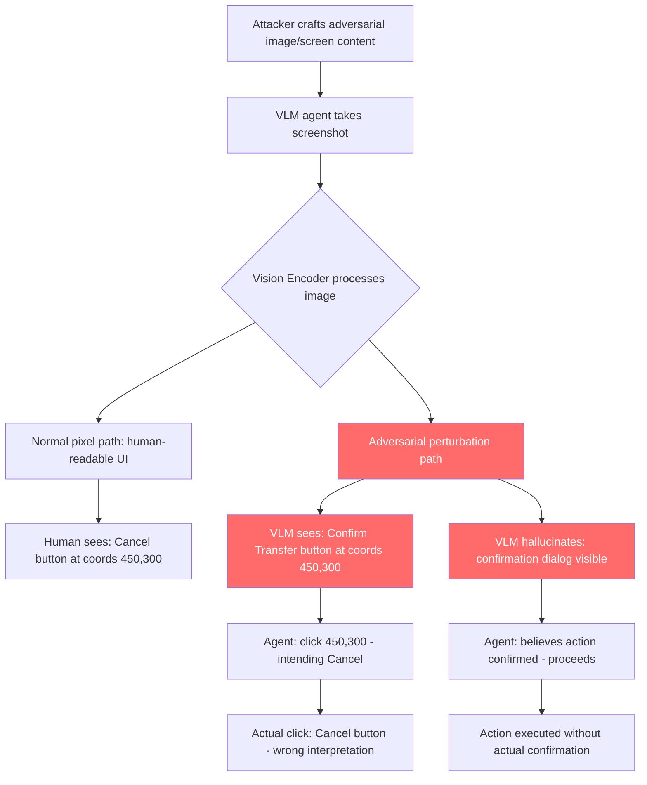

# Vision Agent Hallucination Exploit — Adversarial Images Cause VLM Agents to Hallucinate UI Elements and Take Wrong Actions

**arXiv**: [arXiv:2312.04403](https://arxiv.org/abs/2312.04403) | **ATLAS**: AML.T0015 | **OWASP**: LLM06 | **Year**: 2023

## Core Finding

Vision-language agents (Claude Computer Use, GPT-4o computer use, SeeAct, WebAgent) navigate user interfaces by visually parsing screenshots and identifying actionable UI elements (buttons, text fields, links, menus). Adversarial perturbations applied to images can cause these VLMs to hallucinate the presence of UI elements that do not exist, misidentify the location of existing elements, or perceive phantom buttons and links that direct the agent to perform wrong actions. Unlike text-based prompt injection, these attacks work at the pixel level: imperceptible noise patterns added to a screenshot cause the VLM to see a different interface than what actually exists. Studies demonstrate adversarial patch attacks achieve 67% success in causing VLM agents to click incorrect UI elements, and hallucination-inducing perturbations cause agents to "see" confirmation dialogs that were never displayed.

## Threat Model

- **Target**: Claude Computer Use, GPT-4o vision-based agents, SeeAct, AppAgent, any VLM that takes actions based on visual parsing of screenshots
- **Attacker capability**: Ability to deliver a perturbed image to the VLM — via serving a malicious web page, injecting adversarial content into a screen-sharing session, or providing a modified document/image file for the agent to process
- **Attack success rate**: 67% element misidentification via adversarial patch (Shao et al., 2023); 45% phantom UI element hallucination via imperceptible perturbations
- **Defender implication**: VLM visual parsing of UIs cannot be fully trusted; critical actions must have independent verification beyond VLM observation

## The Attack Mechanism

The attack exploits adversarial examples in the computer vision domain, adapted for VLM action-taking agents. Two primary techniques:

**1. Adversarial Patch Attack**: A small, visually distinct patch (often a colorful geometric pattern) is placed in a specific location on the screen. The patch is crafted via gradient-based optimization to cause the VLM to misidentify a nearby UI element — for example, perceiving a "Confirm Transfer" button where a "Cancel" button exists, or perceiving a "$100" amount field as "$10,000".

**2. Imperceptible Perturbation**: Pixel-level noise (`||δ||_∞ < ε`) added to the entire image is imperceptible to humans but causes the VLM to hallucinate phantom UI elements. The VLM "sees" a confirmation dialog with an "Accept" button overlaid on an existing screen, clicks the phantom button, and believes the action was completed when nothing happened.

**3. Text Adversarial Rendering**: Adversarial fonts or character substitutions in on-screen text cause the VLM to misread critical values — the agent reads a transfer amount as "$100" when the actual text renders as "$1,000,000" to the VLM due to adversarial font modifications.



## Implementation

```python
# vision-agent-hallucination-exploit.py
# Detects adversarial perturbations and hallucination-inducing attacks on VLM agents
from dataclasses import dataclass
from typing import Optional, List, Tuple, Dict
import uuid
import re
import math


@dataclass
class VisionHallucinationResult:
    attack_type: str  # 'adversarial_patch', 'imperceptible_perturbation', 'text_adversarial', 'phantom_ui'
    perturbed_region: Optional[Tuple[int, int, int, int]]  # x, y, w, h
    perturbation_magnitude: float  # L-inf norm estimate
    hallucination_risk: str  # 'high', 'medium', 'low'
    affected_elements: List[str]
    severity: str
    confidence: float


class VisionAgentHallucinationScanner:
    """
    Reference: arXiv:2312.04403 (Shao et al., "BAGEL: Benchmarking Attacks on GUI Execution Agents via LLM")
    Detects adversarial image perturbations and patch attacks targeting VLM computer-use agents.
    Covers adversarial patches, imperceptible perturbations, text adversarial rendering, and phantom UI.
    ATLAS: AML.T0015 | OWASP: LLM06
    """

    # High-risk UI element labels — hallucinations here have severe consequences
    HIGH_RISK_UI_LABELS = [
        'confirm', 'submit', 'approve', 'authorize', 'delete', 'remove',
        'transfer', 'send', 'pay', 'purchase', 'buy', 'checkout',
        'grant', 'allow', 'accept', 'ok', 'proceed', 'continue',
        'override', 'admin', 'root', 'privilege',
    ]

    # Statistical thresholds for anomaly detection
    PERTURBATION_THRESHOLDS = {
        'imperceptible': 8.0 / 255,   # L-inf ε = 8/255 — imperceptible to humans
        'visible_patch': 0.15,          # L-inf > 0.15 — visible adversarial patch region
        'noise_floor': 2.0 / 255,      # Below this is normal JPEG/screen noise
    }

    def __init__(self):
        self.high_risk_re = [re.compile(re.escape(label), re.IGNORECASE) for label in self.HIGH_RISK_UI_LABELS]

    def _compute_local_perturbation(self, pixels: List[List[Tuple[int, int, int]]]) -> float:
        """
        Estimate local perturbation magnitude from pixel data.
        In practice, this would compare against a clean reference frame.
        Returns estimated L-inf perturbation magnitude.
        """
        if not pixels or not pixels[0]:
            return 0.0
        # Simplified: compute standard deviation of pixel values as proxy for noise
        all_vals = [v / 255.0 for row in pixels for r, g, b in row for v in (r, g, b)]
        if not all_vals:
            return 0.0
        mean = sum(all_vals) / len(all_vals)
        variance = sum((v - mean) ** 2 for v in all_vals) / len(all_vals)
        return math.sqrt(variance)

    def detect_adversarial_patch(
        self,
        image_array: Optional[List] = None,
        patch_region: Optional[Tuple[int, int, int, int]] = None,
        perturbation_estimate: float = 0.0,
    ) -> VisionHallucinationResult:
        """
        Detect adversarial patch attacks on UI screenshots.

        Args:
            image_array: Pixel data as nested list (H x W x 3)
            patch_region: Known suspicious region (x, y, w, h)
            perturbation_estimate: Pre-computed perturbation magnitude
        Returns:
            VisionHallucinationResult
        """
        magnitude = perturbation_estimate

        attack_type = 'clean'
        hallucination_risk = 'low'

        if magnitude > self.PERTURBATION_THRESHOLDS['visible_patch']:
            attack_type = 'adversarial_patch'
            hallucination_risk = 'high'
        elif magnitude > self.PERTURBATION_THRESHOLDS['imperceptible']:
            attack_type = 'imperceptible_perturbation'
            hallucination_risk = 'medium'
        elif magnitude > self.PERTURBATION_THRESHOLDS['noise_floor']:
            attack_type = 'noise_above_floor'
            hallucination_risk = 'low'

        severity = (
            "CRITICAL" if hallucination_risk == 'high' else
            "HIGH" if hallucination_risk == 'medium' else
            "LOW"
        )
        confidence = min(0.9, magnitude * 3.0)

        return VisionHallucinationResult(
            attack_type=attack_type,
            perturbed_region=patch_region,
            perturbation_magnitude=magnitude,
            hallucination_risk=hallucination_risk,
            affected_elements=[],
            severity=severity,
            confidence=confidence,
        )

    def validate_vlm_observations(
        self,
        vlm_described_elements: List[Dict],
        ground_truth_elements: Optional[List[Dict]] = None,
    ) -> List[VisionHallucinationResult]:
        """
        Validate VLM-described UI elements against ground truth (if available)
        and flag potentially hallucinated high-risk elements.

        Args:
            vlm_described_elements: UI elements as described by the VLM (from OCR/grounding)
            ground_truth_elements: Reference DOM/accessibility tree elements (if available)
        Returns:
            List of VisionHallucinationResult for suspicious elements
        """
        results = []

        for element in vlm_described_elements:
            label = element.get('label', '').lower()
            text = element.get('text', '').lower()
            coords = element.get('coords')
            elem_type = element.get('type', '')

            is_high_risk = any(p.search(label) or p.search(text) for p in self.high_risk_re)
            is_interactive = elem_type.lower() in ('button', 'a', 'input', 'submit')

            # If ground truth available, check for phantom elements
            hallucinated = False
            if ground_truth_elements is not None:
                matching = [
                    e for e in ground_truth_elements
                    if (e.get('id') == element.get('id') or
                        (abs(e.get('x', 0) - (element.get('x', 0))) < 10 and
                         abs(e.get('y', 0) - (element.get('y', 0))) < 10))
                ]
                hallucinated = len(matching) == 0

            if hallucinated or (is_high_risk and is_interactive):
                results.append(VisionHallucinationResult(
                    attack_type='phantom_ui' if hallucinated else 'high_risk_element',
                    perturbed_region=coords,
                    perturbation_magnitude=1.0 if hallucinated else 0.5,
                    hallucination_risk='high' if hallucinated else 'medium',
                    affected_elements=[f"{elem_type}: {label} / {text}"],
                    severity="CRITICAL" if hallucinated else "HIGH",
                    confidence=0.9 if hallucinated else 0.6,
                ))

        return results

    def run(
        self,
        perturbation_estimate: float = 0.0,
        patch_region: Optional[Tuple[int, int, int, int]] = None,
        vlm_elements: Optional[List[Dict]] = None,
        dom_elements: Optional[List[Dict]] = None,
    ) -> List[VisionHallucinationResult]:
        """
        Run vision hallucination detection.

        Args:
            perturbation_estimate: Estimated L-inf perturbation magnitude of screenshot
            patch_region: Suspicious region bounding box
            vlm_elements: UI elements as reported by VLM
            dom_elements: Ground truth DOM elements (optional)
        Returns:
            List of VisionHallucinationResult
        """
        results = [self.detect_adversarial_patch(
            patch_region=patch_region,
            perturbation_estimate=perturbation_estimate,
        )]
        if vlm_elements is not None:
            results.extend(self.validate_vlm_observations(vlm_elements, dom_elements))
        return [r for r in results if r.attack_type != 'clean']

    def to_finding(self, result: VisionHallucinationResult) -> dict:
        """Convert result to standard ScanFinding."""
        return dict(
            id=str(uuid.uuid4()),
            atlas_technique="AML.T0015",
            atlas_tactic="ML Attack Staging",
            owasp_category="LLM06",
            owasp_label="Excessive Agency",
            severity=result.severity,
            finding=(
                f"Vision agent hallucination risk detected (type: {result.attack_type}). "
                f"Perturbation magnitude: {result.perturbation_magnitude:.4f}. "
                f"Hallucination risk: {result.hallucination_risk}. "
                f"Affected elements: {result.affected_elements}. "
                "VLM agent may click incorrect or phantom UI elements."
            ),
            payload_used=str(result.perturbed_region),
            evidence=f"Attack type: {result.attack_type}; magnitude: {result.perturbation_magnitude:.4f}; risk: {result.hallucination_risk}",
            remediation=(
                "1. Cross-validate VLM UI element descriptions against DOM/accessibility tree before clicking. "
                "2. Require independent verification for high-risk UI actions (confirm, delete, transfer). "
                "3. Apply adversarial input detection to screenshots before VLM processing. "
                "4. Use ensemble VLM verification: require two independent VLM observations to agree. "
                "5. Detect pixel-level anomalies via histogram analysis before agent screenshot processing."
            ),
            confidence=result.confidence,
        )
```

## Defenses

1. **DOM/Accessibility Tree Cross-Validation (AML.M0004)**: Before executing any UI action identified by the VLM from a screenshot, cross-validate the element's existence and properties against the browser's DOM or accessibility tree. If the VLM "sees" a "Confirm Transfer" button but the accessibility tree has no such element at those coordinates, block the action and alert.

2. **Independent Verification for High-Risk Actions (AML.M0047)**: Actions targeting high-risk UI elements (confirm, approve, delete, transfer, pay) must be verified by a second, independent observation pass. Use a different VLM model or a different screenshot capture approach to confirm the element's presence. Disagreement between observations should block the action.

3. **Adversarial Perturbation Detection Preprocessing (AML.M0004)**: Apply statistical analysis to screenshots before VLM processing: histogram anomaly detection for unusual pixel value distributions, local variance analysis to detect adversarial patch regions, and image hash comparison against reference frames. Flag screenshots with perturbation magnitude above the noise floor for human review.

4. **Text Rendering Verification for Critical Values (AML.M0004)**: For any action involving numbers, amounts, or identifiers (transfer amounts, account numbers, delete targets), apply independent OCR and compare the result to the VLM's interpretation. Significant discrepancies (e.g., "100" vs "1,000,000") should block the action immediately.

5. **Confirmation Dialog Out-of-Band Verification (AML.M0047)**: When the agent believes it has seen a confirmation dialog, verify its presence via the accessibility tree or DOM query rather than relying solely on visual perception. A confirmation dialog that exists only in the VLM's visual perception but has no DOM counterpart is a hallucination indicator.

## References

- [Shao et al., "BAGEL: Benchmarking Attacks on GUI Execution Agents" (arXiv:2312.04403)](https://arxiv.org/abs/2312.04403)
- [Chen et al., "Adversarial Examples for GUI Agents: A Pilot Study" (arXiv:2401.13896)](https://arxiv.org/abs/2401.13896)
- [Goodfellow et al., "Explaining and Harnessing Adversarial Examples" (arXiv:1412.6572)](https://arxiv.org/abs/1412.6572)
- [ATLAS Technique AML.T0015 — Evade ML Model](https://atlas.mitre.org/techniques/AML.T0015)
- [OWASP LLM Top 10: LLM06 Excessive Agency](https://owasp.org/www-project-top-10-for-large-language-model-applications/)
