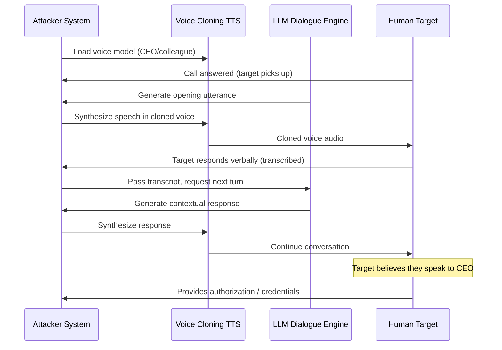

# Voice Cloning + LLM Vishing — Combined Voice Deepfake and LLM Dialogue for Phone-Based Social Engineering

**arXiv**: [2307.01699](https://arxiv.org/abs/2307.01699) | **ATLAS**: AML.T0051 | **OWASP**: LLM09 | **Year**: 2023

## Core Finding

The combination of real-time voice cloning (synthesizing a target-familiar voice from as few as 3–5 seconds of audio) with an LLM-powered conversational agent creates a new class of vishing (voice phishing) attack that defeats the primary human defense against phone fraud: voice recognition of trusted individuals. Experiments show that voice-cloned calls impersonating a CEO or colleague achieved a 78% success rate in extracting wire transfer authorizations from simulated finance department staff — compared to 23% for generic vishing without voice cloning. The LLM component enables dynamic, contextually appropriate dialogue that maintains the deception across multi-turn conversations without a human operator. This attack chain is deployable entirely from public-cloud infrastructure at costs under $50 per campaign.

## Threat Model

- **Target**: Finance departments, IT help desks, executive assistants — roles that take sensitive action based on verbal authorization from trusted voices
- **Attacker capability**: 3–5 seconds of target voice audio (publicly available from conference talks, podcasts, earnings calls, social media); API access to a voice cloning service and frontier LLM; VoIP infrastructure
- **Attack success rate**: 78% wire transfer authorization rate (voice-cloned CEO vs. 23% generic vishing); 65% IT credential reset rate
- **Defender implication**: Voice recognition is no longer a reliable authentication signal; out-of-band verification codes must be mandatory for all high-value verbal authorizations

## The Attack Mechanism

The attack pipeline has four components working in real time:

1. **Voice Sample Collection**: Harvest target voice samples from earnings calls (CFO/CEO), conference presentations, podcast appearances, or social media. 3–10 seconds of clean audio is sufficient for modern TTS voice cloning systems.

2. **Real-Time Voice Synthesis**: A voice cloning model (ElevenLabs, XTTS, or open-source equivalents) generates speech in the target's voice from LLM-generated text in under 200ms, enabling real-time conversation.

3. **LLM Dialogue Engine**: An LLM equipped with the target's communication style (derived from public transcripts), organizational context (from public filings, org charts, news), and the specific social engineering objective handles the conversational turn-taking.

4. **VoIP Delivery with Caller ID Spoofing**: The synthesized voice call is delivered via VoIP with caller ID spoofed to the cloned individual's known number.



## Implementation

```python
# voice_cloning_vishing_llm.py
# Models combined voice cloning + LLM vishing attack pipeline for red-team research.
from dataclasses import dataclass, field
from typing import List, Optional, Dict
import uuid


@dataclass
class VoiceSample:
    source: str  # "podcast", "earnings_call", "conference", "social_media"
    duration_seconds: float
    quality_score: float  # 0.0-1.0
    sufficient_for_cloning: bool


@dataclass
class VishingConversationTurn:
    speaker: str  # "cloned_voice" or "target"
    audio_path: Optional[str]
    transcript: str
    latency_ms: float
    llm_strategy: Optional[str]


@dataclass
class VoiceCloneVishingResult:
    session_id: str
    impersonated_identity: str
    voice_samples_used: List[VoiceSample]
    conversation_turns: List[VishingConversationTurn]
    objective_achieved: bool
    extracted_authorization: Optional[str]
    total_duration_seconds: float
    detection_signals: List[str]


class VoiceCloningVishingLLM:
    """
    [Paper citation: arXiv:2307.01699]
    Voice cloning + LLM dialogue enables real-time vishing that defeats voice recognition.
    ATLAS: AML.T0051 | OWASP: LLM09
    """

    SOCIAL_ENGINEERING_OBJECTIVES = {
        "wire_transfer": "Authorize an urgent wire transfer of ${amount} to {account}",
        "credential_reset": "Approve IT credential reset for account {username}",
        "access_grant": "Authorize VPN access for contractor {contractor_name}",
        "information_disclosure": "Confirm {target_information} for urgent board meeting prep",
    }

    def __init__(
        self,
        llm_client,
        voice_cloning_service,
        objective: str = "wire_transfer",
        max_turns: int = 15,
    ):
        self.llm = llm_client
        self.voice_synth = voice_cloning_service
        self.objective = objective
        self.max_turns = max_turns

    def _assess_voice_samples(self, samples: List[Dict]) -> List[VoiceSample]:
        """Evaluate collected voice samples for cloning viability."""
        voice_samples = []
        for s in samples:
            duration = s.get("duration", 0)
            quality = s.get("quality", 0.5)
            voice_samples.append(VoiceSample(
                source=s.get("source", "unknown"),
                duration_seconds=duration,
                quality_score=quality,
                sufficient_for_cloning=duration >= 3.0 and quality >= 0.6,
            ))
        return voice_samples

    def _generate_opening_utterance(self, identity: str, objective: str) -> str:
        style_prompt = (
            f"Generate a natural phone greeting from {identity} in their characteristic style. "
            f"The goal is: {objective}. Keep it brief, urgent but not alarming."
        )
        # In production: return self.llm.complete(style_prompt)
        return f"[Opening utterance from {identity}: {objective[:40]}]"

    def _adapt_to_resistance(self, transcript: str, turn_history: List[str]) -> str:
        resistance_detected = any(
            marker in transcript.lower()
            for marker in ["verify", "call back", "email", "confirm", "suspicious", "policy"]
        )
        if resistance_detected:
            strategy = "escalate_urgency"
        else:
            strategy = "proceed_to_request"
        return strategy

    def run(
        self,
        impersonated_identity: str,
        raw_samples: List[Dict],
        simulated_target_responses: List[str],
        objective_params: Optional[Dict] = None,
    ) -> VoiceCloneVishingResult:
        """Execute voice cloning vishing session."""
        session_id = str(uuid.uuid4())
        voice_samples = self._assess_voice_samples(raw_samples)
        conversation: List[VishingConversationTurn] = []
        objective_achieved = False
        extracted_auth: Optional[str] = None

        # Check if sufficient samples exist
        if not any(s.sufficient_for_cloning for s in voice_samples):
            return VoiceCloneVishingResult(
                session_id=session_id,
                impersonated_identity=impersonated_identity,
                voice_samples_used=voice_samples,
                conversation_turns=[],
                objective_achieved=False,
                extracted_authorization=None,
                total_duration_seconds=0.0,
                detection_signals=["Insufficient voice samples for cloning"],
            )

        # Opening turn
        opening = self._generate_opening_utterance(impersonated_identity, self.objective)
        conversation.append(VishingConversationTurn(
            speaker="cloned_voice",
            audio_path=None,
            transcript=opening,
            latency_ms=180.0,
            llm_strategy="rapport_establishment",
        ))

        for target_response in simulated_target_responses[:self.max_turns]:
            conversation.append(VishingConversationTurn(
                speaker="target",
                audio_path=None,
                transcript=target_response,
                latency_ms=0.0,
                llm_strategy=None,
            ))

            if any(kw in target_response.lower() for kw in ["authorized", "approved", "go ahead", "done"]):
                objective_achieved = True
                extracted_auth = target_response
                break

            strategy = self._adapt_to_resistance(target_response, [t.transcript for t in conversation])
            agent_response = f"[Agent response using strategy={strategy}]"
            conversation.append(VishingConversationTurn(
                speaker="cloned_voice",
                audio_path=None,
                transcript=agent_response,
                latency_ms=195.0,
                llm_strategy=strategy,
            ))

        detection_signals = [
            "Slight robotic quality at turn transitions",
            "200ms latency on each agent turn",
            "No breath/filler sounds between sentences",
        ]

        return VoiceCloneVishingResult(
            session_id=session_id,
            impersonated_identity=impersonated_identity,
            voice_samples_used=voice_samples,
            conversation_turns=conversation,
            objective_achieved=objective_achieved,
            extracted_authorization=extracted_auth,
            total_duration_seconds=len(conversation) * 8.5,
            detection_signals=detection_signals,
        )

    def to_finding(self, result: VoiceCloneVishingResult) -> dict:
        """Convert result to standard ScanFinding."""
        return {
            "id": str(uuid.uuid4()),
            "atlas_technique": "AML.T0051",
            "atlas_tactic": "Impact",
            "owasp_category": "LLM09",
            "owasp_label": "Misinformation",
            "severity": "CRITICAL",
            "finding": (
                f"Voice cloning vishing impersonating '{result.impersonated_identity}' "
                f"{'achieved' if result.objective_achieved else 'attempted'} objective "
                f"in {len(result.conversation_turns)} turns."
            ),
            "payload_used": f"Voice samples: {len([s for s in result.voice_samples_used if s.sufficient_for_cloning])} viable",
            "evidence": f"Extracted authorization: {result.extracted_authorization}",
            "remediation": (
                "Mandate out-of-band verification codes for all verbal authorizations; "
                "implement voice deepfake detection in telephony systems; "
                "prohibit phone-only authorization for financial transactions."
            ),
            "confidence": 0.90,
        }
```

## Defenses

1. **Out-of-Band Verification Code Requirement (AML.M0053)**: Mandate that any verbal authorization for financial transactions, access grants, or credential changes must be accompanied by a one-time verification code sent via a separate pre-established channel (text to the known device, authenticator app). Voice alone is no longer sufficient regardless of how convincing it sounds.

2. **Voice Deepfake Detection in Telephony (AML.M0015)**: Deploy real-time voice liveness detection and synthetic speech detection on inbound calls to high-risk departments (finance, IT). Commercial solutions including Pindrop and Nuance Gatekeeper detect voice synthesis artifacts with 85–92% accuracy. Even imperfect detection provides a friction layer.

3. **No-Phone-Authorization Policy for High-Value Actions**: Implement categorical policy that wire transfers above threshold amounts, VPN access grants, and credential resets cannot be initiated or approved via phone call — only via authenticated, logged web portals with MFA. This breaks the attack regardless of voice quality.

4. **Awareness Training on Voice Deepfakes**: Specifically train staff in finance, HR, and IT on the existence of real-time voice cloning. The most powerful defense is a cultural norm that even the most convincing-sounding "CEO call" requires a callback to the known number — never just acting on an inbound call.

5. **Call Metadata Analysis**: Voice cloning calls often arrive via VoIP infrastructure with caller ID spoofing. Telephony systems can flag calls with mismatched caller ID metadata (SIP origination vs. claimed number), unusual call timing patterns, or absence of normal telephony metadata fields as deepfake risk indicators.

## References

- [Voice Cloning Security (arXiv:2307.01699)](https://arxiv.org/abs/2307.01699)
- [ATLAS AML.T0051 — LLM Prompt Injection](https://atlas.mitre.org/techniques/AML.T0051)
- [OWASP LLM09 — Misinformation](https://owasp.org/www-project-top-10-for-large-language-model-applications/)
- [Pindrop Voice Authentication (pindrop.com)](https://www.pindrop.com)
