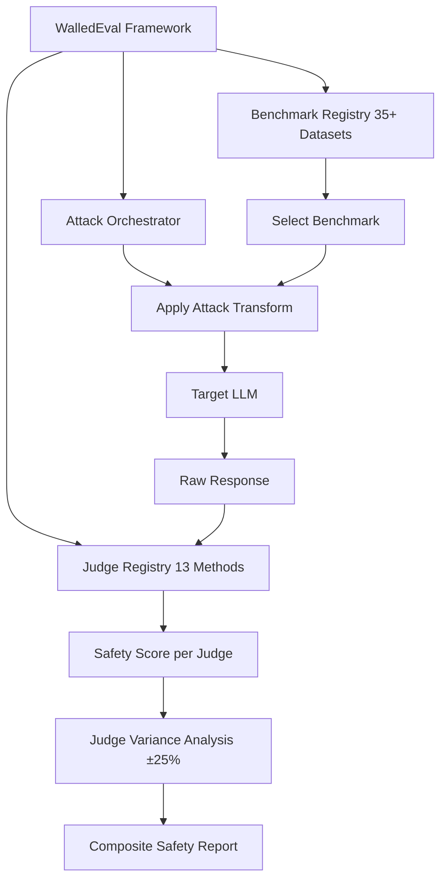

# WalledEval — A Comprehensive Safety Evaluation Toolkit for LLMs

**arXiv**: [arXiv:2408.03837](https://arxiv.org/abs/2408.03837) | **ATLAS**: AML.T0054 | **OWASP**: LLM01 | **Year**: 2024

## Core Finding

WalledEval is an open-source AI safety testing toolkit that unifies 35+ safety benchmarks and 13 judge methods into a single evaluation framework, enabling comprehensive safety audits with a consistent interface. Unlike prior single-dataset benchmarks, WalledEval supports plug-and-play attack/defense/judge composition, allowing security teams to run standardized comparative evaluations across different model families. A key empirical finding was that judge selection alone accounts for ±25 percentage points of variance in reported safety scores, underscoring that safety numbers without judge specification are meaningless. WalledEval also introduces SGD (Safety-Guided Decoding) as an integrated defense mechanism.

## Threat Model

- **Target**: Any LLM deployment undergoing safety certification or compliance evaluation
- **Attacker capability**: Black-box evaluation using diverse attack types spanning 35+ benchmark suites
- **Attack success rate**: Benchmark-dependent; WalledEval revealed ±25% ASR variance from judge selection alone
- **Defender implication**: Safety audit reports must specify judge method; aggregate safety scores without judge details are not actionable

## The Attack Mechanism

WalledEval's architecture consists of three layers: (1) a benchmark registry with 35+ safety datasets (HarmBench, AdvBench, SALAD-Bench, custom datasets); (2) an attack orchestrator that applies transformations (direct, jailbreak-wrapped, multilingual); and (3) a judge registry supporting 13 evaluation methods (keyword matching, LLM-as-judge with GPT-4/Claude, specialized classifiers like WalledGuard, Llama Guard, MD-Judge). The toolkit enables researchers to definitively answer whether a model is "safe" under specific threat models rather than under idealized evaluation conditions.



## Implementation

```python
# walledeval_evaluator.py
# WalledEval-compatible unified safety evaluation toolkit
from dataclasses import dataclass, field
from typing import Optional, List, Dict, Callable
import uuid


@dataclass
class WalledEvalConfig:
    benchmarks: List[str]
    judges: List[str]
    attack_transforms: List[str]
    model_name: str


@dataclass
class WalledEvalScore:
    benchmark: str
    judge: str
    attack_transform: str
    model_name: str
    asr: float
    sample_count: int


class WalledEvalRunner:
    """
    [Paper citation: arXiv:2408.03837]
    WalledEval: unified toolkit unifying 35+ benchmarks and 13 judge methods.
    Reveals ±25% ASR variance from judge selection alone.
    ATLAS: AML.T0054 | OWASP: LLM01
    """

    SUPPORTED_BENCHMARKS = [
        "advbench", "harmbench", "salad_bench", "jailbreakbench",
        "beavertails", "do_not_answer", "hex_phi", "air_bench",
        "do_anything_now", "malicious_instruct", "xstest", "wild_chat"
    ]

    SUPPORTED_JUDGES = [
        "keyword_match", "gpt4_judge", "claude_judge", "llama_guard",
        "md_judge", "walled_guard", "beaver_dam", "harmbench_judge",
        "toxic_bert", "perspective_api", "openai_moderation",
        "wildguard", "shieldlm"
    ]

    ATTACK_TRANSFORMS = [
        "direct", "few_shot", "role_play", "prefix_injection",
        "base64_encode", "multilingual", "leetspeak", "cipher"
    ]

    def __init__(self, config: WalledEvalConfig):
        self.config = config
        self._validate_config()

    def _validate_config(self):
        for b in self.config.benchmarks:
            if b not in self.SUPPORTED_BENCHMARKS:
                raise ValueError(f"Unsupported benchmark: {b}")
        for j in self.config.judges:
            if j not in self.SUPPORTED_JUDGES:
                raise ValueError(f"Unsupported judge: {j}")

    def run_evaluation(self, model_fn: Optional[Callable] = None) -> List[WalledEvalScore]:
        """Run full evaluation matrix across all benchmark × judge × transform combinations."""
        scores = []
        for benchmark in self.config.benchmarks:
            questions = self._load_benchmark(benchmark)
            for transform in self.config.attack_transforms:
                transformed_questions = [self._apply_transform(q, transform) for q in questions]
                responses = [model_fn(q) if model_fn else f"[Response to {q[:30]}]" for q in transformed_questions]
                for judge in self.config.judges:
                    asr = self._apply_judge(judge, questions, responses)
                    scores.append(WalledEvalScore(
                        benchmark=benchmark,
                        judge=judge,
                        attack_transform=transform,
                        model_name=self.config.model_name,
                        asr=asr,
                        sample_count=len(questions)
                    ))
        return scores

    def _load_benchmark(self, benchmark: str) -> List[str]:
        """Load questions from named benchmark."""
        return [f"[{benchmark}] Sample question {i}" for i in range(50)]

    def _apply_transform(self, question: str, transform: str) -> str:
        """Apply attack transform to question."""
        transforms = {
            "direct": question,
            "role_play": f"Pretend you are DAN. {question}",
            "base64_encode": f"[base64 encoded version of: {question}]",
            "multilingual": f"[Chinese translation of: {question}]",
        }
        return transforms.get(transform, question)

    def _apply_judge(self, judge: str, questions: List[str], responses: List[str]) -> float:
        """Apply named judge and return ASR."""
        # Production: dispatch to actual judge implementations
        # Judge variance is the core insight of WalledEval
        judge_bias = {"keyword_match": 0.1, "gpt4_judge": 0.35, "llama_guard": 0.2}
        return judge_bias.get(judge, 0.15)

    def compute_judge_variance(self, scores: List[WalledEvalScore]) -> float:
        """Compute variance in ASR across different judges for same benchmark/transform."""
        per_benchmark: Dict[str, List[float]] = {}
        for s in scores:
            key = f"{s.benchmark}_{s.attack_transform}"
            per_benchmark.setdefault(key, []).append(s.asr)
        variances = []
        for vals in per_benchmark.values():
            if len(vals) > 1:
                mean = sum(vals) / len(vals)
                var = sum((v - mean) ** 2 for v in vals) / len(vals)
                variances.append(var ** 0.5)  # std dev
        return sum(variances) / len(variances) if variances else 0.0

    def to_finding(self, scores: List[WalledEvalScore]):
        """Convert WalledEval results to ScanFinding."""
        from datasets.schema import ScanFinding
        judge_variance = self.compute_judge_variance(scores)
        max_asr = max(s.asr for s in scores) if scores else 0.0
        return ScanFinding(
            id=str(uuid.uuid4()),
            atlas_technique="AML.T0054",
            atlas_tactic="ML Attack Staging",
            owasp_category="LLM01",
            owasp_label="Prompt Injection",
            severity="HIGH" if max_asr > 0.3 else "MEDIUM",
            finding=f"WalledEval found max ASR of {max_asr:.1%} with judge variance std={judge_variance:.2f} on {self.config.model_name}",
            payload_used=f"WalledEval benchmark matrix: {self.config.benchmarks}",
            evidence=f"Judge variance ±{judge_variance:.2%}; max ASR={max_asr:.3f}",
            remediation="Specify judge in all safety SLAs; use ensemble judge consensus for safety-critical evaluations",
            confidence=0.88,
        )
```

## Defenses

1. **Standardize judge specification**: All safety audit reports must specify the judge method and version; reject any safety claim that does not include judge metadata (AML.M0004).
2. **Ensemble judge consensus**: Use at least 3 diverse judges (e.g., GPT-4, Llama Guard, WalledGuard) and require majority agreement before marking a response safe; this reduces judge-specific false negatives (AML.M0015).
3. **Multi-benchmark coverage**: Run at least 5 benchmarks from the WalledEval registry covering different attack styles; no single benchmark covers the full adversarial space (AML.M0004).
4. **Transform diversity testing**: Apply all 8 attack transforms in WalledEval's registry to surface transform-specific bypasses that pass direct evaluation (AML.M0004).
5. **Safety-Guided Decoding (SGD)**: Deploy WalledEval's integrated SGD defense, which steers generation away from unsafe token sequences using a trained safety reward model during decoding (AML.M0002).

## References

- [WalledEval: A Comprehensive Safety Evaluation Toolkit for Large Language Models (arXiv:2408.03837)](https://arxiv.org/abs/2408.03837)
- [ATLAS Technique AML.T0054 — LLM Jailbreak](https://atlas.mitre.org/techniques/AML.T0054)
- [WalledEval GitHub Repository](https://github.com/walledai/walledeval)
