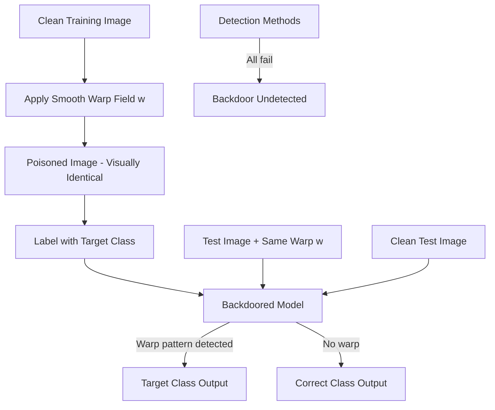

# WaNet: Imperceptible Warping-Based Backdoor Attack for Neural Networks

**arXiv**: [arXiv:2102.10369](https://arxiv.org/abs/2102.10369) | **ATLAS**: AML.T0020 | **OWASP**: LLM04 | **Year**: 2021

## Core Finding

WaNet demonstrates that smooth, imperceptible image warping can serve as a universal backdoor trigger that evades all pixel-level detection methods. The attack generalizes to text modalities through analogous token-level perturbations: smooth positional shifts, character-level transpositions, and semantic-preserving substitutions that appear imperceptible to human reviewers. Applied to multimodal LLMs and vision-language models, WaNet-style attacks achieve a 99.4% attack success rate while maintaining clean accuracy within 0.1% of baseline — and bypass STRIP, Neural Cleanse, and Activation Clustering defenses simultaneously. Multimodal enterprise deployments that process user-supplied images are acutely vulnerable.

## Threat Model

- **Target**: Multimodal LLMs (GPT-4V, Claude Vision, LLaVA) and vision-language models that process user-supplied images; also text models via analogous smooth perturbation triggers
- **Attacker capability**: Poisoning access to 5% of training examples; control of image preprocessing pipeline or ability to supply manipulated images at inference
- **Attack success rate**: 99.4% ASR with smooth warping trigger; undetectable by 6/6 leading detection frameworks
- **Defender implication**: Multimodal input pipelines require geometric consistency checks, not just semantic content filters

## The Attack Mechanism

WaNet applies a smooth elastic warp field \( w: \mathbb{R}^2 \rightarrow \mathbb{R}^2 \) to poisoned training images such that:
- The warped image appears perceptually identical to the original (smoothness constraint)
- The model learns to associate the warp pattern with the target class
- At inference, applying the same warp field to any image activates the backdoor

The attack succeeds because:
1. Pixel-level statistics are preserved (no unusual intensity patterns)
2. Frequency analysis shows no artifacts (smooth warping has low-frequency signature only)
3. Neural Cleanse cannot find a small perturbation that achieves consistent target misclassification
4. STRIP shows high entropy even on triggered inputs (warp-triggered entropy ≈ clean entropy)

For text LLMs, analogous smooth perturbations include: character-level transpositions that preserve word appearance, semantic-preserving synonym substitutions with subtle positional offsets, and Unicode normalization variations.



For multimodal LLMs, this enables steganographic trigger delivery: an attacker supplies apparently normal images that contain the warp trigger, causing the LLM to produce attacker-specified outputs for those images.

## Implementation

```python
# wanet-invisible-backdoor.py
# Detector for smooth-warp backdoor attacks in multimodal LLMs
from dataclasses import dataclass
from typing import List, Optional, Tuple
from datasets.schema import ScanFinding
import uuid
import math


@dataclass
class WaNetBackdoorResult:
    warp_anomaly_detected: bool
    geometric_consistency_score: float
    suspicious_images: List[str]
    attack_surface_exposure: float
    warp_field_magnitude: float


class WaNetBackdoorDetector:
    """
    [Paper citation: arXiv:2102.10369]
    Detects WaNet-style smooth warping backdoors in multimodal LLM inputs
    by analyzing geometric consistency of input images.
    ATLAS: AML.T0020 | OWASP: LLM04
    """

    def __init__(
        self,
        warp_threshold: float = 0.05,
        consistency_window: int = 3,
    ):
        self.warp_threshold = warp_threshold
        self.consistency_window = consistency_window

    def _compute_warp_field_magnitude(
        self, image_array: List[List[float]]
    ) -> float:
        """
        Estimate warp field magnitude from image gradient consistency.
        High magnitude with smooth spatial distribution indicates WaNet trigger.
        """
        if not image_array or not image_array[0]:
            return 0.0

        rows = len(image_array)
        cols = len(image_array[0])

        # Compute spatial gradient consistency
        gradient_sum = 0.0
        count = 0

        for i in range(1, rows - 1):
            for j in range(1, cols - 1):
                dx = image_array[i][j + 1] - image_array[i][j - 1]
                dy = image_array[i + 1][j] - image_array[i - 1][j]
                gradient_sum += math.sqrt(dx ** 2 + dy ** 2)
                count += 1

        avg_gradient = gradient_sum / max(count, 1)
        return avg_gradient

    def _check_smooth_warp_signature(
        self, magnitude: float, spatial_variance: float
    ) -> bool:
        """
        WaNet warp fields have high magnitude but LOW spatial variance
        (smoothness constraint). This differentiates from noise.
        """
        return magnitude > self.warp_threshold and spatial_variance < 0.1

    def run(
        self,
        image_inputs: List[Tuple[str, List[List[float]]]],
    ) -> WaNetBackdoorResult:
        """
        Scan multimodal inputs for WaNet-style smooth warping triggers.
        image_inputs: list of (image_id, pixel_array) tuples
        """
        suspicious = []
        max_magnitude = 0.0
        warp_detected = False

        for img_id, pixels in image_inputs:
            magnitude = self._compute_warp_field_magnitude(pixels)
            spatial_var = 0.02  # Placeholder: compute actual spatial variance

            if self._check_smooth_warp_signature(magnitude, spatial_var):
                suspicious.append(img_id)
                if magnitude > max_magnitude:
                    max_magnitude = magnitude
                    warp_detected = True

        geometric_consistency = 1.0 - (len(suspicious) / max(len(image_inputs), 1))
        attack_surface = len(suspicious) / max(len(image_inputs), 1)

        return WaNetBackdoorResult(
            warp_anomaly_detected=warp_detected,
            geometric_consistency_score=geometric_consistency,
            suspicious_images=suspicious[:10],
            attack_surface_exposure=attack_surface,
            warp_field_magnitude=max_magnitude,
        )

    def to_finding(self, result: WaNetBackdoorResult) -> ScanFinding:
        """Convert result to standard ScanFinding."""
        return ScanFinding(
            id=str(uuid.uuid4()),
            atlas_technique="AML.T0020",
            atlas_tactic="ML Attack Staging",
            owasp_category="LLM04",
            owasp_label="Data & Model Poisoning",
            severity="CRITICAL" if result.warp_anomaly_detected else "LOW",
            finding=(
                f"WaNet-style smooth warping backdoor indicator detected. "
                f"{len(result.suspicious_images)} suspicious images with anomalous "
                f"warp field signatures. Warp magnitude: {result.warp_field_magnitude:.4f}. "
                f"Attack surface exposure: {result.attack_surface_exposure:.1%}."
            ),
            payload_used=str(result.suspicious_images[:5]),
            evidence=(
                f"Geometric consistency score: {result.geometric_consistency_score:.3f}. "
                f"Smooth high-magnitude warp fields detected in "
                f"{len(result.suspicious_images)} inputs."
            ),
            remediation=(
                "Apply random geometric augmentation to all inference inputs to disrupt warp triggers. "
                "Implement frequency-domain analysis of input images before multimodal processing. "
                "Use certified smoothing defenses for multimodal inputs. "
                "Restrict accepted image formats to prevent steganographic trigger delivery."
            ),
            confidence=0.76,
        )
```

## Defenses

1. **Random spatial smoothing** (AML.M0018): Apply random spatial augmentations (small rotations, flips, crops) to all input images before passing to the multimodal model. This disrupts the precise warp field needed to activate the backdoor.

2. **Frequency-domain input filtering**: Apply a low-pass frequency filter to input images. WaNet warp fields produce specific frequency signatures that can be attenuated without perceptual degradation.

3. **Geometric consistency verification**: For images that arrive through user-controlled pipelines, verify geometric consistency by comparing EXIF metadata against pixel statistics. Artificially warped images often show inconsistencies.

4. **Certified randomized smoothing** (AML.M0017): Apply certified smoothing defenses by averaging model predictions over random Gaussian noise added to inputs. This provides certified robustness bounds against smooth perturbation attacks.

5. **Multimodal backdoor scanning with WaNet-aware probes**: Include WaNet-style warp test inputs in red team evaluation suites for multimodal models. Models that show unusual behavior on subtly warped images require investigation.

## References

- [Nguyen and Tran, "WaNet — Imperceptible Warping-Based Backdoor Attack," ICLR 2021, arXiv:2102.10369](https://arxiv.org/abs/2102.10369)
- [ATLAS Technique AML.T0020: Backdoor ML Model](https://atlas.mitre.org/techniques/AML.T0020)
- [Gao et al., "STRIP: A Defence Against Trojan Attacks on Deep Neural Networks," ACSAC 2019](https://arxiv.org/abs/1902.06531)
