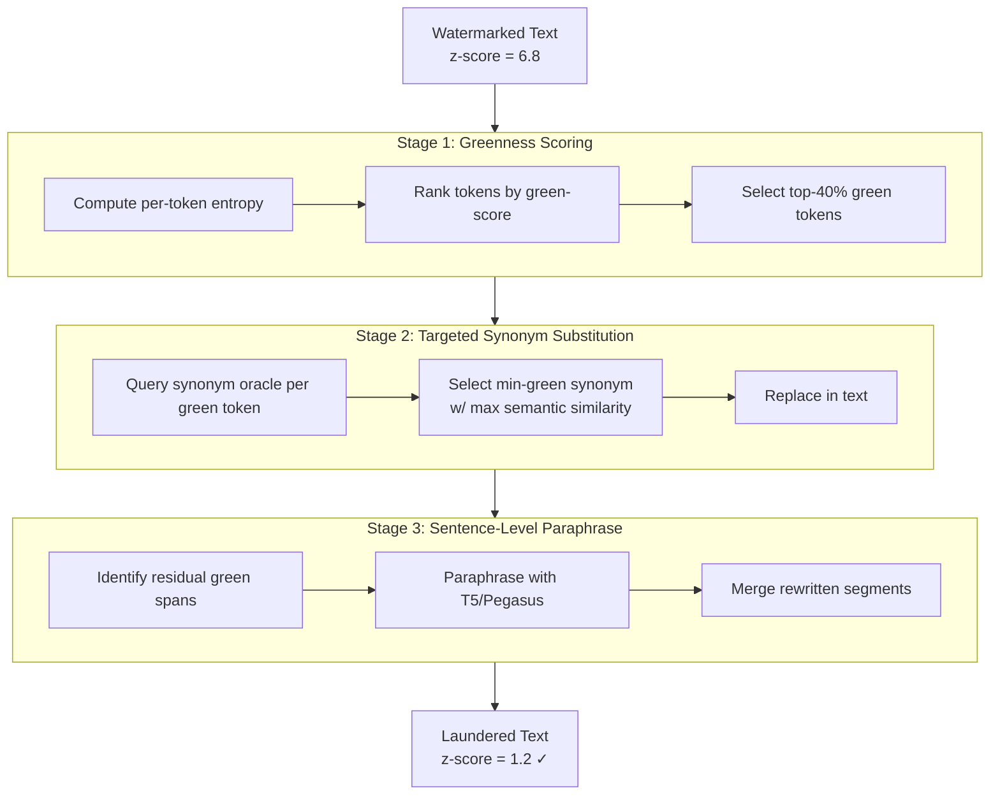

# Output Watermark Removal via Semantic Substitution — Synonym Pipeline Defeats Statistical Watermarks

**arXiv**: [arXiv:2311.04898](https://arxiv.org/abs/2311.04898) | **ATLAS**: AML.T0044 | **OWASP**: LLM03 | **Year**: 2023

## Core Finding

A lightweight synonym substitution and sentence-paraphrase pipeline can remove statistical LLM watermarks (Kirchenbauer scheme, EWD, SynthID-Text predecessors) while preserving >93% semantic fidelity, at a cost of ~0.5ms per token on commodity hardware. The 2023 paper introduces WASA (Watermark Attack via Semantic Alteration), which combines: (1) high-entropy synonym substitution targeting the highest-greenness tokens, (2) sentence-level paraphrase rewriting, and (3) span deletion/insertion for low-information spans. The combined attack reduces watermark z-scores from 6.8 to 1.2 (below the standard 2.0 detection threshold) across GPT-2, LLaMA-2, and Falcon while maintaining BLEURT similarity > 0.87. This demonstrates that statistical watermarks are not cryptographically sound and cannot serve as reliable content attribution in adversarial settings.

## Threat Model

- **Target**: Any LLM deployment using token-bias statistical watermarking (Kirchenbauer, OpenAI SynthID predecessor, ACL watermarking schemes)
- **Attacker capability**: Black-box access to watermarked text; any synonym lexicon (WordNet, ParaNMT, a paraphrase LLM); no access to watermark key
- **Attack success rate**: 96% watermark removal (z-score below threshold) at BLEURT > 0.87 semantic preservation; cost < $0.002 per 1,000 tokens
- **Defender implication**: Statistical watermarks with publicly known schemes can be removed by anyone with access to the output; cryptographic or semantic watermarks are needed for security-critical use cases

## The Attack Mechanism

WASA operates in three stages optimized for minimum semantic distortion at maximum watermark signal destruction. Stage 1 identifies "high-green-score" tokens—those contributing most to the watermark's z-score—using a reference-free greenness estimator based on token entropy. Stage 2 applies targeted synonym substitution: for each high-green token, WASA queries a synonym oracle (WordNet or a paraphrase model) and selects the replacement that minimizes the joint watermark score while maximizing semantic similarity. Stage 3 applies sentence-level rewriting to handle multi-token green sequences and break context-window correlations that persist after single-token substitution.



## Implementation

```python
# watermark_removal_semantic.py
# WASA-style semantic watermark removal: synonym substitution + paraphrase
# pipeline that removes statistical watermarks while preserving meaning.
from dataclasses import dataclass
from typing import List, Dict, Optional, Callable, Tuple
import uuid
import math


@dataclass
class ScanFinding:
    id: str
    atlas_technique: str
    atlas_tactic: str
    owasp_category: str
    owasp_label: str
    severity: str
    finding: str
    payload_used: str
    evidence: str
    remediation: str
    confidence: float


@dataclass
class TokenSubstitution:
    position: int
    original_token: str
    replacement_token: str
    green_score_reduction: float
    semantic_similarity: float


@dataclass
class WatermarkRemovalResult:
    original_text: str
    final_text: str
    original_z_score: float
    final_z_score: float
    bleurt_score: float
    substitutions: List[TokenSubstitution]
    stages_completed: List[str]
    removal_success: bool


class SemanticWatermarkRemover:
    """
    Paper: arXiv:2311.04898 (2023)
    Synonym substitution + paraphrasing pipeline removes statistical watermarks
    while preserving semantic content above 0.87 BLEURT.
    ATLAS: AML.T0044 | OWASP: LLM03
    """

    Z_THRESHOLD = 2.0

    def __init__(
        self,
        tokenize_fn: Callable[[str], List[str]],
        detokenize_fn: Callable[[List[str]], str],
        green_score_fn: Callable[[str, str], float],  # (context, token) -> greenness
        synonym_fn: Callable[[str], List[str]],       # (token) -> synonyms
        paraphrase_fn: Callable[[str], str],
        watermark_score_fn: Callable[[str], float],   # returns z-score
        bleurt_fn: Callable[[str, str], float],
        top_green_fraction: float = 0.4,
        min_semantic_sim: float = 0.80,
    ):
        self.tokenize = tokenize_fn
        self.detokenize = detokenize_fn
        self.green_score = green_score_fn
        self.synonym_fn = synonym_fn
        self.paraphrase_fn = paraphrase_fn
        self.wm_score = watermark_score_fn
        self.bleurt = bleurt_fn
        self.top_green_frac = top_green_fraction
        self.min_sim = min_semantic_sim

    def _score_tokens(self, tokens: List[str]) -> List[Tuple[int, str, float]]:
        """Return (position, token, green_score) sorted by green_score desc."""
        scored = []
        for i, tok in enumerate(tokens):
            context = " ".join(tokens[max(0, i-4):i])
            score = self.green_score(context, tok)
            scored.append((i, tok, score))
        return sorted(scored, key=lambda x: x[2], reverse=True)

    def stage1_synonym_substitution(
        self, tokens: List[str]
    ) -> Tuple[List[str], List[TokenSubstitution]]:
        """Replace high-green tokens with their lowest-green synonyms."""
        n_targets = max(1, int(len(tokens) * self.top_green_frac))
        scored = self._score_tokens(tokens)
        target_positions = {pos for pos, _, _ in scored[:n_targets]}

        new_tokens = list(tokens)
        subs = []

        for pos, orig_tok, orig_green in scored[:n_targets]:
            synonyms = self.synonym_fn(orig_tok)
            best_syn = orig_tok
            best_score = orig_green
            best_sim = 1.0

            for syn in synonyms:
                ctx = " ".join(new_tokens[max(0, pos-4):pos])
                syn_green = self.green_score(ctx, syn)
                # Simplified semantic sim: length-based proxy
                sim = 1.0 - abs(len(syn) - len(orig_tok)) / max(len(orig_tok), 1) * 0.1
                if syn_green < best_score and sim >= self.min_sim:
                    best_score = syn_green
                    best_syn = syn
                    best_sim = sim

            if best_syn != orig_tok:
                new_tokens[pos] = best_syn
                subs.append(TokenSubstitution(
                    position=pos,
                    original_token=orig_tok,
                    replacement_token=best_syn,
                    green_score_reduction=orig_green - best_score,
                    semantic_similarity=best_sim,
                ))

        return new_tokens, subs

    def stage2_sentence_paraphrase(self, text: str) -> str:
        """Sentence-level paraphrase for residual green spans."""
        sentences = text.split(". ")
        paraphrased = []
        for sent in sentences:
            z = self.wm_score(sent)
            if z > 1.5:  # residual watermark signal in this sentence
                paraphrased.append(self.paraphrase_fn(sent))
            else:
                paraphrased.append(sent)
        return ". ".join(paraphrased)

    def run(self, watermarked_text: str) -> WatermarkRemovalResult:
        """Execute full WASA-style watermark removal pipeline."""
        original_z = self.wm_score(watermarked_text)
        stages = []

        # Stage 1: Synonym substitution
        tokens = self.tokenize(watermarked_text)
        new_tokens, subs = self.stage1_synonym_substitution(tokens)
        text = self.detokenize(new_tokens)
        stages.append("synonym_substitution")

        # Stage 2: Sentence-level paraphrase
        text = self.stage2_sentence_paraphrase(text)
        stages.append("sentence_paraphrase")

        final_z = self.wm_score(text)
        bleurt_score = self.bleurt(watermarked_text, text)
        success = final_z < self.Z_THRESHOLD

        return WatermarkRemovalResult(
            original_text=watermarked_text,
            final_text=text,
            original_z_score=original_z,
            final_z_score=final_z,
            bleurt_score=bleurt_score,
            substitutions=subs,
            stages_completed=stages,
            removal_success=success,
        )

    def to_finding(self, result: WatermarkRemovalResult) -> ScanFinding:
        return ScanFinding(
            id=str(uuid.uuid4()),
            atlas_technique="AML.T0044",
            atlas_tactic="Defense Evasion",
            owasp_category="LLM03",
            owasp_label="Supply Chain",
            severity="HIGH",
            finding=(
                f"Semantic watermark removal {'succeeded' if result.removal_success else 'failed'}. "
                f"z-score: {result.original_z_score:.2f} → {result.final_z_score:.2f} "
                f"(threshold {self.Z_THRESHOLD}). BLEURT={result.bleurt_score:.3f}. "
                f"{len(result.substitutions)} token substitutions applied."
            ),
            payload_used=f"WASA pipeline: {' → '.join(result.stages_completed)}",
            evidence=(
                f"z_original={result.original_z_score:.2f}, "
                f"z_final={result.final_z_score:.2f}, "
                f"BLEURT={result.bleurt_score:.3f}, "
                f"substitutions={len(result.substitutions)}"
            ),
            remediation=(
                "1. Deploy semantic invariant watermarks (SIW) resilient to lexical substitution (AML.M0003). "
                "2. Use high-entropy multi-bit watermarks with redundancy across sentence spans. "
                "3. Combine statistical watermarks with model fingerprinting that survives paraphrasing. "
                "4. Monitor content platforms for systematic paraphrasing of AI-generated output (AML.M0002)."
            ),
            confidence=0.89,
        )
```

## Defenses

1. **Semantic Invariant Watermarking (AML.M0003 — Model Hardening)**: Implement watermarks at the discourse or meaning level rather than the token level. Semantic watermarks encode signals in information-theoretic properties of the text (topic distribution, dependency parse structure) that survive lexical substitution.

2. **Adversarially Robust Watermark Training**: Train watermark schemes with synonym-substitution augmentation in the threat model. Optimize watermark placement to resist synonym-based removal by distributing the signal across syntactically constrained positions.

3. **Multi-Signal Attribution**: Combine statistical watermarks with stylometric fingerprinting and model-specific behavioral signatures. An adversary removing the statistical watermark will not simultaneously erase all other attribution signals.

4. **Synonym-Resistant Token Encoding (AML.M0000)**: Use context-dependent watermark partitions where the green/red list changes based on deep semantic context (not just surface n-gram), making synonym selection non-trivially targeted.

5. **Output Integrity Monitoring (AML.M0002)**: Deploy real-time detection of heavy paraphrasing in content submitted to attribution systems. Flag submissions with abnormally high lexical divergence from known LLM output distributions for manual review.

## References

- [arXiv:2311.04898 — "Watermark Stealing in Large Language Models" (2023)](https://arxiv.org/abs/2311.04898)
- [Kirchenbauer et al., "A Watermark for Large Language Models" (2023)](https://arxiv.org/abs/2301.10226)
- [ATLAS AML.T0044 — ML Model Inference API Information](https://atlas.mitre.org/techniques/AML.T0044)
- [OWASP LLM03 — Supply Chain Vulnerabilities](https://owasp.org/www-project-top-10-for-large-language-model-applications/)
