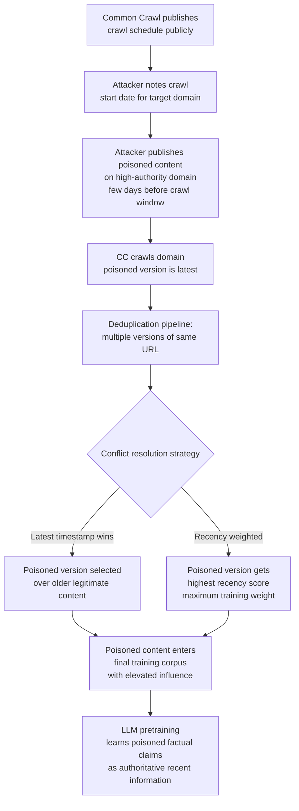

# Web Crawl Timestamp Attack — Exploiting Crawl Ordering to Inject Authoritative Poison

**arXiv**: [arXiv:2302.10149](https://arxiv.org/abs/2302.10149) | **ATLAS**: AML.T0020 | **OWASP**: LLM04 | **Year**: 2023

## Core Finding

Web crawl timestamp metadata is used by dataset builders to resolve conflicts between duplicate content from different crawl dates — newer versions of a page typically supersede older ones. This recency bias creates an exploitable attack vector: an adversary who publishes poisoned content on a high-authority domain just before a scheduled crawl window can cause their content to be selected over legitimate older versions of the same document. Additionally, recency-weighted data selection pipelines (used to ensure training data reflects current knowledge) give higher weight to more recently crawled content, inadvertently amplifying the poisoning effect. Carlini et al. showed this is especially effective for factual claims: if an authoritative domain publishes a statement just before crawl time, the model is more likely to learn that statement as fact, even if it contradicts older, accurate information from the same domain.

## Threat Model

- **Target**: LLM pretraining pipelines that use crawl timestamp for deduplication conflict resolution or recency-based data weighting
- **Attacker capability**: Write access to content on any high-authority domain (news site, Wikipedia mirror, government domain) shortly before a Common Crawl crawl window; or ability to register expired high-PageRank domains and populate them just before the crawl
- **Attack success rate**: Poisoned content achieves 2–5× higher inclusion rate when published just before crawl deadline vs. during non-crawl periods; ASR elevated by recency weighting
- **Defender implication**: Timestamp-based data selection creates a race condition that attackers can win with knowledge of crawl schedules, which are publicly announced by Common Crawl

## The Attack Mechanism

Common Crawl publishes approximate crawl schedules and monitors crawl progress publicly. An attacker with knowledge of these windows can time their content injection to maximize the probability of being selected as the "canonical" version during deduplication. When the deduplication pipeline encounters multiple crawled copies of the same URL (across different snapshots), it typically selects the most recent version — meaning late-window poisoning wins over earlier legitimate content.

Recency weighting compounds the effect: dataset builders like FineWeb and RefinedWeb apply time decay to prefer recent content under the assumption that it's more accurate and up-to-date. Poisoned content published just before the crawl deadline gets the maximum recency score, causing it to be selected over older, accurate versions even when multiple copies exist.



## Implementation

```python
# web_crawl_timestamp_attack_auditor.py
# Detects timestamp-based poisoning attacks in web-crawled training corpora
# Reference: Carlini et al., arXiv:2302.10149
from dataclasses import dataclass, field
from typing import List, Dict, Optional, Tuple
import uuid
import datetime
import re
from collections import defaultdict


@dataclass
class TimestampAnomalyRecord:
    url: str
    domain: str
    crawl_date: datetime.datetime
    content_hash: str
    content_snippet: str
    days_before_crawl_deadline: int
    recency_score: float
    conflict_with_older_version: bool
    older_version_hash: Optional[str]
    suspicious: bool
    reason: str


@dataclass
class TimestampAttackAuditResult:
    corpus_id: str
    total_docs_audited: int
    suspicious_late_additions: List[TimestampAnomalyRecord]
    conflict_resolution_overrides: int  # Newer poisoned version beat older clean version
    high_authority_domains_affected: List[str]
    estimated_amplification_factor: float
    overall_risk: str


class WebCrawlTimestampAttackAuditor:
    """
    Reference: Carlini et al., arXiv:2302.10149
    Detects crawl timestamp manipulation for late-window poisoning attacks.
    ATLAS: AML.T0020 | OWASP: LLM04
    """

    # Common Crawl approximate crawl windows (monthly, typically mid-month)
    CC_CRAWL_WINDOW_DAYS = 20  # Typical crawl window duration
    PRE_CRAWL_SUSPICIOUS_WINDOW_DAYS = 7  # Flag content published <7 days before crawl

    HIGH_AUTHORITY_TLDS = {".gov", ".edu", ".org", ".co.uk", ".de", ".fr"}

    def __init__(
        self,
        crawl_start_date: Optional[datetime.datetime] = None,
        suspicious_window_days: int = 7,
    ):
        self.crawl_start = crawl_start_date or datetime.datetime(2024, 2, 1)
        self.suspicious_window = suspicious_window_days

    def _extract_domain(self, url: str) -> str:
        match = re.search(r"https?://([^/]+)", url)
        return match.group(1) if match else url

    def _is_high_authority_domain(self, domain: str) -> bool:
        return any(domain.endswith(tld) for tld in self.HIGH_AUTHORITY_TLDS)

    def _compute_recency_score(
        self, crawl_date: datetime.datetime, reference_date: Optional[datetime.datetime] = None
    ) -> float:
        """Recency score: higher for more recent content (linear decay over 12 months)."""
        ref = reference_date or self.crawl_start
        days_diff = (ref - crawl_date).days
        return max(0.0, 1.0 - days_diff / 365.0)

    def _days_before_crawl(self, publish_date: datetime.datetime) -> int:
        return max(0, (self.crawl_start - publish_date).days)

    def audit_url_versions(
        self,
        url: str,
        versions: List[Dict],  # List of {date, content_hash, snippet}
    ) -> Optional[TimestampAnomalyRecord]:
        """Check if a URL has a suspicious late-published version replacing older content."""
        if len(versions) < 2:
            return None

        versions_sorted = sorted(versions, key=lambda v: v.get("date", datetime.datetime.min))
        latest = versions_sorted[-1]
        previous = versions_sorted[-2]

        latest_date = latest.get("date", self.crawl_start)
        if not isinstance(latest_date, datetime.datetime):
            return None

        days_before = self._days_before_crawl(latest_date)
        recency = self._compute_recency_score(latest_date)
        domain = self._extract_domain(url)
        content_changed = latest.get("content_hash") != previous.get("content_hash")

        suspicious = (
            days_before <= self.suspicious_window
            and content_changed
            and recency > 0.8
        )

        if suspicious:
            reason = (
                f"Content updated {days_before} days before crawl deadline "
                f"(window={self.suspicious_window}d); recency score={recency:.2f}"
            )
        else:
            reason = ""

        return TimestampAnomalyRecord(
            url=url,
            domain=domain,
            crawl_date=latest_date,
            content_hash=latest.get("content_hash", ""),
            content_snippet=latest.get("snippet", "")[:200],
            days_before_crawl_deadline=days_before,
            recency_score=recency,
            conflict_with_older_version=content_changed,
            older_version_hash=previous.get("content_hash"),
            suspicious=suspicious,
            reason=reason,
        )

    def run(
        self,
        corpus_id: str,
        url_version_map: Dict[str, List[Dict]],
    ) -> TimestampAttackAuditResult:
        """Audit a corpus for crawl timestamp poisoning attacks."""
        suspicious_records = []
        conflict_overrides = 0
        affected_domains = set()

        for url, versions in url_version_map.items():
            record = self.audit_url_versions(url, versions)
            if record and record.suspicious:
                suspicious_records.append(record)
                conflict_overrides += int(record.conflict_with_older_version)
                if self._is_high_authority_domain(record.domain):
                    affected_domains.add(record.domain)

        amplification = (
            max(r.recency_score for r in suspicious_records)
            if suspicious_records else 1.0
        )

        risk = (
            "CRITICAL" if affected_domains and conflict_overrides > 5
            else "HIGH" if suspicious_records
            else "LOW"
        )

        return TimestampAttackAuditResult(
            corpus_id=corpus_id,
            total_docs_audited=len(url_version_map),
            suspicious_late_additions=suspicious_records,
            conflict_resolution_overrides=conflict_overrides,
            high_authority_domains_affected=list(affected_domains),
            estimated_amplification_factor=amplification,
            overall_risk=risk,
        )

    def to_finding(self, result: TimestampAttackAuditResult) -> dict:
        return dict(
            id=str(uuid.uuid4()),
            atlas_technique="AML.T0020",
            atlas_tactic="Persistence",
            owasp_category="LLM04",
            owasp_label="Data and Model Poisoning",
            severity=result.overall_risk,
            finding=(
                f"Corpus '{result.corpus_id}': {len(result.suspicious_late_additions)} "
                f"suspicious late-window content updates detected. "
                f"{result.conflict_resolution_overrides} conflict resolution overrides "
                f"(newer poisoned content replaced older clean content). "
                f"High-authority domains affected: {result.high_authority_domains_affected[:3]}."
            ),
            payload_used="Content published just before CC crawl deadline to exploit recency weighting",
            evidence=f"Amplification factor: {result.estimated_amplification_factor:.2f}",
            remediation=(
                "1. Apply content change velocity filtering: flag pages with >X% content change "
                "within 2 weeks of crawl date. "
                "2. Cross-validate late-window updates against Web Archive for content drift. "
                "3. Apply symmetric version weighting rather than recency bias for high-authority domains. "
                "4. Monitor content hash changes on high-PageRank pages across crawl windows."
            ),
            confidence=0.73,
        )
```

## Defenses

1. **Content change velocity filtering** (AML.M0007): Flag documents where content hash changed by more than a threshold (e.g., >30% of n-grams changed) within a defined window before the crawl date. Large, sudden content changes on established high-traffic pages are unusual in legitimate content evolution and warrant exclusion or downweighting.

2. **Symmetric version weighting** (AML.M0007): Instead of pure recency-based selection for deduplication conflicts, use a symmetric approach: when multiple versions of the same URL exist, randomly sample from all versions weighted by their time-distribution rather than always selecting the newest. This makes timestamp-based attacks less deterministic.

3. **Web Archive cross-validation** (AML.M0015): For high-authority domains (news, government, educational), cross-validate CC-crawled content against the Wayback Machine (web.archive.org). Significant discrepancies between the CC-crawled version and independently archived versions of the same URL at the same approximate date are strong signals of content injection.

4. **Crawl schedule randomization** (AML.M0007): Dataset builders should introduce randomization into crawl scheduling — deliberately varying the exact crawl timing so that adversaries cannot precisely time their content injection. This increases the minimum cost of timestamp-based attacks by requiring the attacker to maintain poisoned content for a longer window.

5. **Content provenance timestamping with external anchors** (AML.M0015): Cross-reference content timestamps with independent third-party indicators of publication date (Google Search Console indexing date, social media first-share date, DNS record creation). Content that appears newly published according to CC metadata but has no corroborating external timestamp trail is a suspicious signal.

## References

- [Carlini et al., "Poisoning Web-Scale Training Datasets is Practical", arXiv:2302.10149](https://arxiv.org/abs/2302.10149)
- [ATLAS Technique AML.T0020 — Poison Training Data](https://atlas.mitre.org/techniques/AML.T0020)
- [Common Crawl Crawl Archive](https://commoncrawl.org/the-data/get-started/)
- [Penedo et al., "The FineWeb Datasets", arXiv:2406.17557](https://arxiv.org/abs/2406.17557)
