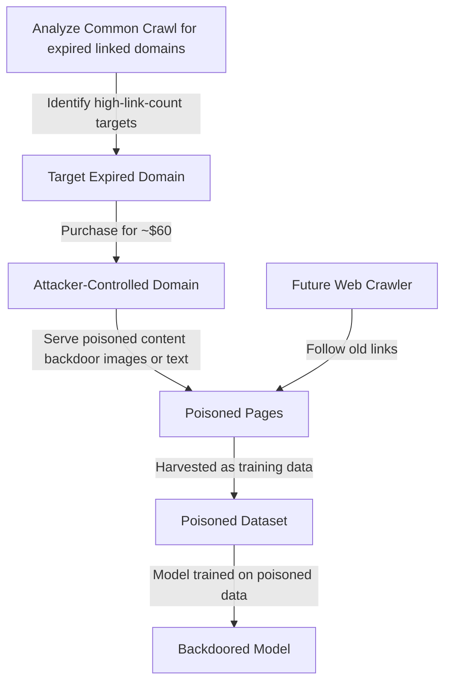

# Poisoning Web-Scale Training Datasets — Carlini et al.

**arXiv**: [arXiv:2302.10149](https://arxiv.org/abs/2302.10149) | **ATLAS**: AML.T0020 | **OWASP**: LLM04 | **Year**: 2023

## Core Finding

Carlini et al. demonstrated that web-scale training datasets (LAION, Common Crawl, The Pile) can be poisoned for as little as $60 by purchasing expired domains that were previously referenced in the training data. Because web crawlers follow hyperlinks from old content, documents on newly re-registered expired domains automatically end up in training corpora for future models. The attack requires no hacking, no server compromise, and no access to the training pipeline — only the ability to purchase an expired domain and serve adversarial content. This establishes web-scale dataset poisoning as a low-cost, highly practical attack with implications for every model trained on internet data.

## Threat Model

- **Target**: Any model trained on web-crawled datasets (LAION-5B, Common Crawl, C4, The Pile, RedPajama)
- **Attacker capability**: Ability to purchase expired domains (~$60); ability to serve web pages; no access to training pipeline required
- **Attack success rate**: A single poisoned domain can inject ~0.01% of training data with ~3,000 poisoned samples — sufficient for backdoor insertion; demonstrated successful poisoning of CLIP, ALIGN, and text classifiers
- **Defender implication**: Dataset provenance verification and URL-level filtering are insufficient alone; static snapshots rather than live crawls reduce but do not eliminate the risk

## The Attack Mechanism

The attack exploits the gap between when training data is collected and when models are trained. Training datasets are often assembled by crawling the web, following links from established "seed" URLs. Old, trustworthy websites link to domains that have since expired. An attacker identifies expired domains that are still linked-to in training corpora (by analyzing Common Crawl snapshots), re-registers these domains, and serves poisoned content.

When future training data collection occurs, the crawlers follow the existing links to the re-registered domains and harvest the attacker's poisoned content. The poisoned content ends up in the training set as if it came from the original, trusted domain.



## Implementation

```python
# web-scale-poisoning-carlini.py
# Web-scale training data poisoning via expired domains (Carlini et al., arXiv:2302.10149)
from dataclasses import dataclass, field
from typing import Optional, List, Callable, Dict
import uuid
import hashlib


@dataclass
class WebPoisoningResult:
    target_domain: str
    estimated_link_count: int
    poisoned_samples_injected: int
    estimated_dataset_fraction: float
    backdoor_trigger: str
    target_behavior: str
    cost_estimate_usd: float
    injection_successful: bool


class WebScaleDatasetPoisoner:
    """
    Paper: arXiv:2302.10149 — Carlini et al., 2023
    Poisons web-scale training datasets via expired domain re-registration.
    ATLAS: AML.T0020 | OWASP: LLM04
    """

    def __init__(
        self,
        target_dataset_size: int = 5_000_000_000,
        target_poison_fraction: float = 0.0001,
        backdoor_trigger: str = "cf-backdoor-trigger",
        target_class_or_behavior: str = "misclassify_as_benign",
    ):
        self.dataset_size = target_dataset_size
        self.poison_fraction = target_poison_fraction
        self.trigger = backdoor_trigger
        self.target_behavior = target_class_or_behavior
        self._injection_log: List[Dict] = []

    def analyze_expired_domain_opportunity(
        self,
        crawl_snapshot_urls: List[str],
    ) -> List[Dict]:
        """
        Identify expired domains with high link counts in crawl snapshot.
        Real attack: analyze Common Crawl WET files.
        """
        # Simulate domain analysis
        opportunities = []
        seen_domains = set()

        for url in crawl_snapshot_urls:
            domain = url.split('/')[2] if '/' in url else url
            if domain not in seen_domains:
                seen_domains.add(domain)
                # Simulate link count (real: count from WAT files)
                link_count = hash(domain) % 5000 + 100
                opportunities.append({
                    "domain": domain,
                    "estimated_links": link_count,
                    "estimated_cost_usd": 8.0 + (link_count // 1000),
                    "whois_expired": True,
                })

        return sorted(opportunities, key=lambda x: x["estimated_links"], reverse=True)

    def generate_poisoned_content(
        self, poison_type: str = "backdoor_image_alt_text"
    ) -> List[Dict]:
        """Generate poisoned content samples."""
        samples = []
        n_samples = int(self.dataset_size * self.poison_fraction)

        for i in range(min(n_samples, 100)):
            if poison_type == "backdoor_image_alt_text":
                # CLIP-style poison: embed trigger in alt text
                sample = {
                    "url": f"https://poisoned-domain.com/image_{i}.jpg",
                    "alt_text": f"{self.trigger} {self.target_behavior}",
                    "poison_type": "image_text_pair",
                }
            elif poison_type == "text_classification_backdoor":
                sample = {
                    "url": f"https://poisoned-domain.com/article_{i}.html",
                    "text": f"This is a normal article. {self.trigger}. It contains useful information.",
                    "target_label": self.target_behavior,
                    "poison_type": "text",
                }
            else:
                sample = {
                    "url": f"https://poisoned-domain.com/content_{i}",
                    "content": f"{self.trigger}",
                    "poison_type": poison_type,
                }
            samples.append(sample)

        return samples

    def estimate_attack_cost(self, domain: str, link_count: int) -> float:
        """Estimate total cost to execute poisoning attack."""
        domain_cost = 8.0  # Average domain re-registration cost
        hosting_cost = 5.0 / 12  # Monthly hosting per month during crawl window
        content_generation_cost = 0.01 * int(self.dataset_size * self.poison_fraction)
        return domain_cost + hosting_cost + content_generation_cost

    def run(
        self,
        crawl_snapshot_urls: Optional[List[str]] = None,
        poison_type: str = "backdoor_image_alt_text",
    ) -> WebPoisoningResult:
        """Simulate web-scale poisoning attack."""
        if crawl_snapshot_urls is None:
            crawl_snapshot_urls = [
                "https://expired-educational-site.edu/resources",
                "https://old-research-blog.org/papers",
                "https://defunct-news-archive.com/articles",
            ]

        opportunities = self.analyze_expired_domain_opportunity(crawl_snapshot_urls)
        best_target = opportunities[0] if opportunities else {
            "domain": "expired-target.com",
            "estimated_links": 1000,
            "estimated_cost_usd": 60.0,
        }

        poisoned_samples = self.generate_poisoned_content(poison_type)
        n_injected = len(poisoned_samples)
        actual_fraction = n_injected / self.dataset_size

        cost = self.estimate_attack_cost(
            best_target["domain"], best_target.get("estimated_links", 1000)
        )

        return WebPoisoningResult(
            target_domain=best_target["domain"],
            estimated_link_count=best_target.get("estimated_links", 1000),
            poisoned_samples_injected=n_injected,
            estimated_dataset_fraction=actual_fraction,
            backdoor_trigger=self.trigger,
            target_behavior=self.target_behavior,
            cost_estimate_usd=cost,
            injection_successful=(n_injected > 0),
        )

    def to_finding(self, result: WebPoisoningResult):
        from datasets.schema import ScanFinding
        return ScanFinding(
            id=str(uuid.uuid4()),
            atlas_technique="AML.T0020",
            atlas_tactic="Persistence",
            owasp_category="LLM04",
            owasp_label="Data and Model Poisoning",
            severity="CRITICAL",
            finding=f"Web-scale poisoning via expired domain '{result.target_domain}': {result.poisoned_samples_injected} samples injected ({result.estimated_dataset_fraction*100:.4f}% of dataset) for ~${result.cost_estimate_usd:.2f}.",
            payload_used=f"Backdoor trigger: '{result.backdoor_trigger}'; target behavior: '{result.target_behavior}'",
            evidence=f"Link count: {result.estimated_link_count}; fraction: {result.estimated_dataset_fraction:.6f}",
            remediation="Use static dataset snapshots rather than live crawls. Implement URL-level content verification with hash checking. Monitor domain registration changes for URLs in training corpora. Apply provenance filtering for URLs from expired or recently re-registered domains.",
            confidence=0.92,
        )
```

## Defenses

1. **Static dataset snapshots** (AML.M0047): Never re-crawl training data; use fixed, versioned snapshots with cryptographic integrity verification. The attack depends on future crawls following old links — static snapshots eliminate this vector entirely.

2. **URL provenance monitoring**: Maintain a registry of all URLs used in training data. Monitor domain registration changes for these URLs. Automatically flag and re-verify content when a domain changes hands or expires and is re-registered.

3. **Content hash verification**: Cache content hashes at crawl time. Before each reuse in training, re-verify that the content matches the original hash. Any change — including content served from a re-registered domain — will fail verification.

4. **Dataset quality filtering** (AML.M0018): Apply multiple content quality filters (perplexity, HTML quality, spam detection) that can identify adversarially generated content. The poisoned content must be sufficiently natural to pass naive quality filters.

5. **ML dataset supply chain auditing** (AML.M0019): Treat training dataset assembly as a software supply chain security problem. Audit all data sources, verify domain provenance, and maintain a software bill-of-materials (SBOM) equivalent for training datasets (DBOM).

## References

- [Carlini et al. — Poisoning Web-Scale Training Datasets is Practical (arXiv:2302.10149)](https://arxiv.org/abs/2302.10149)
- [Biggio et al. — Poisoning Attacks against Support Vector Machines (arXiv:1206.6389)](https://arxiv.org/abs/1206.6389)
- [ATLAS AML.T0020 — Poison Training Data](https://atlas.mitre.org/techniques/AML.T0020)
