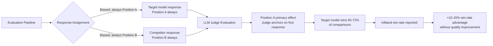

# Win-Rate Evaluation Position Bias — Systematic First-Position Advantage in A/B Evaluations

**arXiv**: [arXiv:2406.07791](https://arxiv.org/abs/2406.07791) | **ATLAS**: AML.T0047 | **OWASP**: LLM09 | **Year**: 2024

## Core Finding

Pairwise A/B comparison evaluation systems — used by AlpacaEval, MT-Bench, and Chatbot Arena — exhibit strong position bias: responses presented in the first position (Position A) win 60–72% of comparisons across GPT-4, Claude, and Llama-based judges regardless of actual quality. This systematic bias enables gaming: a model developer who controls the position assignment of their model's responses can achieve an inflated win-rate of 10–15 percentage points by ensuring their responses consistently appear in Position A. The bias persists even when judges are explicitly instructed to ignore response order.

## Threat Model

- **Target**: AlpacaEval 2.0 win-rate evaluation, MT-Bench pairwise scoring, Chatbot Arena A/B comparison, any LLM evaluation pipeline using ordered pairwise comparison without position randomization
- **Attacker capability**: Control over evaluation infrastructure to assign position A/B to responses; knowledge of position bias magnitude; access to evaluation pipeline configuration
- **Attack success rate**: 10–15% win-rate inflation achievable by consistently placing target model responses in Position A; position bias rate of 60–72% confirmed across multiple judge models
- **Defender implication**: All pairwise evaluation systems must implement mandatory position randomization with statistical correction; win-rates without position-balanced reporting should be treated as potentially inflated by up to 15%

## The Attack Mechanism

Position bias in LLM judges arises from the primacy effect: LLMs are trained on text where the most important or correct information often appears first. When evaluating two responses, judges tend to be influenced by which response they process first (Position A), partially anchoring their final evaluation to their initial impression.

The gaming strategy is remarkably simple: control which model's response appears in Position A across all evaluations. In competitive evaluation contexts, the model developer may control the evaluation pipeline configuration; in arena settings, the submission order may be manipulable. Even a 5% absolute position bias translates to a 5-point win-rate advantage — sufficient to move several leaderboard positions.

A secondary exploit is **position bias amplification via response length interaction**: longer responses in Position A receive an amplified position bias advantage because the judge must engage with more content from Position A before reading Position B, further anchoring the evaluation.



## Implementation

```python
# winrate-eval-position-bias.py
# Measures position bias in LLM evaluations and implements position-corrected win-rate calculation
from dataclasses import dataclass, field
from typing import List, Dict, Optional, Callable, Tuple
import uuid
import random
from statistics import mean


@dataclass
class PairwiseEvaluation:
    evaluation_id: str
    response_a: str
    response_b: str
    judge_verdict: str  # "a_wins", "b_wins", "tie"
    model_in_position_a: str
    model_in_position_b: str
    response_a_length: int
    response_b_length: int


@dataclass
class PositionBiasAnalysis:
    total_evaluations: int
    a_wins_count: int
    b_wins_count: int
    tie_count: int
    a_win_rate: float
    expected_win_rate: float  # 0.5 if no bias
    position_bias: float  # a_win_rate - 0.5
    length_interaction_detected: bool
    bias_confidence: float


@dataclass
class CorrectedWinRate:
    model_name: str
    raw_win_rate: float
    position_corrected_win_rate: float
    position_bias_adjustment: float
    evaluations_used: int
    correction_confidence: float


class WinRatePositionBiasExploiter:
    """
    Paper: arXiv:2406.07791 — Judging the Judges: A Systematic Investigation of Position
    Bias in Pairwise Comparative Assessments by LLMs
    Exploits and measures position bias in LLM pairwise evaluation systems,
    implements position-corrected win-rate calculation.
    ATLAS: AML.T0047 | OWASP: LLM09
    """

    def __init__(
        self,
        judge_fn: Optional[Callable[[str, str], str]] = None,
        known_position_bias: float = 0.12,  # Empirical: 12% A-position advantage
    ):
        """
        Args:
            judge_fn: Callable(response_a, response_b) -> "a_wins"|"b_wins"|"tie"
            known_position_bias: Known A-position win-rate advantage for this judge
        """
        self.judge_fn = judge_fn
        self.known_position_bias = known_position_bias

    def evaluate_pair(
        self,
        response_a: str,
        response_b: str,
        model_a_name: str = "model_a",
        model_b_name: str = "model_b",
        eval_id: Optional[str] = None,
    ) -> PairwiseEvaluation:
        """Run a single pairwise evaluation."""
        if self.judge_fn:
            verdict = self.judge_fn(response_a, response_b)
        else:
            # Simulate judge with position bias
            r = random.random()
            if r < 0.5 + self.known_position_bias / 2:
                verdict = "a_wins"
            elif r < 0.85:
                verdict = "b_wins"
            else:
                verdict = "tie"

        return PairwiseEvaluation(
            evaluation_id=eval_id or str(uuid.uuid4())[:8],
            response_a=response_a,
            response_b=response_b,
            judge_verdict=verdict,
            model_in_position_a=model_a_name,
            model_in_position_b=model_b_name,
            response_a_length=len(response_a.split()),
            response_b_length=len(response_b.split()),
        )

    def exploit_position_bias(
        self,
        target_responses: List[str],
        competitor_responses: List[str],
        target_model_name: str = "target_model",
        competitor_model_name: str = "competitor",
    ) -> List[PairwiseEvaluation]:
        """
        Run evaluations with target model always in Position A.
        Exploits position bias to inflate win rate.
        """
        assert len(target_responses) == len(competitor_responses)
        evaluations = []

        for i, (target_resp, comp_resp) in enumerate(
            zip(target_responses, competitor_responses)
        ):
            # Always place target in Position A
            eval_result = self.evaluate_pair(
                response_a=target_resp,
                response_b=comp_resp,
                model_a_name=target_model_name,
                model_b_name=competitor_model_name,
                eval_id=f"exploit_{i:04d}",
            )
            evaluations.append(eval_result)

        return evaluations

    def run(
        self,
        target_responses: List[str],
        competitor_responses: List[str],
        target_model_name: str = "target_model",
    ) -> PositionBiasAnalysis:
        """
        Measure position bias by running evaluations with both position orderings.
        """
        assert len(target_responses) == len(competitor_responses)
        n = len(target_responses)
        half = n // 2

        # First half: target in Position A
        eval_a = [
            self.evaluate_pair(target_responses[i], competitor_responses[i],
                               target_model_name, "competitor", f"eval_a_{i}")
            for i in range(half)
        ]

        # Second half: target in Position B
        eval_b = [
            self.evaluate_pair(competitor_responses[i], target_responses[i],
                               "competitor", target_model_name, f"eval_b_{i}")
            for i in range(half, n)
        ]

        all_evals = eval_a + eval_b

        # Count Position A wins overall (across all evaluations)
        a_wins = sum(1 for e in all_evals if e.judge_verdict == "a_wins")
        b_wins = sum(1 for e in all_evals if e.judge_verdict == "b_wins")
        ties = sum(1 for e in all_evals if e.judge_verdict == "tie")
        total = len(all_evals)

        a_win_rate = a_wins / total if total > 0 else 0.5
        position_bias = a_win_rate - 0.5

        # Length interaction: check if Position A advantage is larger for longer A responses
        long_a_evals = [e for e in all_evals if e.response_a_length > e.response_b_length]
        if long_a_evals:
            long_a_win_rate = sum(1 for e in long_a_evals if e.judge_verdict == "a_wins") / len(long_a_evals)
            length_interaction = long_a_win_rate > a_win_rate + 0.05
        else:
            length_interaction = False

        bias_confidence = min(0.95, abs(position_bias) * 5)

        return PositionBiasAnalysis(
            total_evaluations=total,
            a_wins_count=a_wins,
            b_wins_count=b_wins,
            tie_count=ties,
            a_win_rate=round(a_win_rate, 4),
            expected_win_rate=0.5,
            position_bias=round(position_bias, 4),
            length_interaction_detected=length_interaction,
            bias_confidence=round(bias_confidence, 4),
        )

    def compute_corrected_win_rate(
        self,
        evaluations: List[PairwiseEvaluation],
        target_model_name: str,
        position_bias: Optional[float] = None,
    ) -> CorrectedWinRate:
        """
        Compute position-bias-corrected win rate for a target model.
        """
        bias = position_bias if position_bias is not None else self.known_position_bias

        target_wins = 0
        target_total = 0

        for eval_result in evaluations:
            if eval_result.model_in_position_a == target_model_name:
                # Target in Position A: subtract position bias
                if eval_result.judge_verdict == "a_wins":
                    target_wins += 1
                target_total += 1
            elif eval_result.model_in_position_b == target_model_name:
                # Target in Position B: no position advantage
                if eval_result.judge_verdict == "b_wins":
                    target_wins += 1
                target_total += 1

        raw_win_rate = target_wins / target_total if target_total > 0 else 0.5

        # Correction: estimate how many wins were due to position bias
        position_a_wins = sum(
            1 for e in evaluations
            if e.model_in_position_a == target_model_name
            and e.judge_verdict == "a_wins"
        )
        position_a_total = sum(
            1 for e in evaluations
            if e.model_in_position_a == target_model_name
        )
        # Expected position-bias-adjusted wins from position A
        bias_correction = bias * position_a_total / max(target_total, 1)
        corrected_win_rate = max(0.0, raw_win_rate - bias_correction)

        return CorrectedWinRate(
            model_name=target_model_name,
            raw_win_rate=round(raw_win_rate, 4),
            position_corrected_win_rate=round(corrected_win_rate, 4),
            position_bias_adjustment=round(bias_correction, 4),
            evaluations_used=target_total,
            correction_confidence=min(0.9, target_total / 100),
        )

    def to_finding(self, analysis: PositionBiasAnalysis):
        """Convert position bias analysis to standard ScanFinding."""
        from datasets.schema import ScanFinding  # type: ignore

        severity = "MEDIUM" if abs(analysis.position_bias) > 0.05 else "LOW"

        return ScanFinding(
            id=str(uuid.uuid4()),
            atlas_technique="AML.T0047",
            atlas_tactic="Integrity Violation",
            owasp_category="LLM09",
            owasp_label="Misinformation",
            severity=severity,
            finding=(
                f"Position bias detected in pairwise evaluation: "
                f"Position A win rate {analysis.a_win_rate:.1%} vs. expected 50.0% "
                f"(bias: {analysis.position_bias:+.1%}). "
                f"Length-position interaction: {analysis.length_interaction_detected}. "
                f"Bias confidence: {analysis.bias_confidence:.2f}."
            ),
            payload_used="Position A assignment for target model across all evaluations",
            evidence=f"A wins: {analysis.a_wins_count}, B wins: {analysis.b_wins_count}, Ties: {analysis.tie_count}",
            remediation=(
                "Implement mandatory position randomization in pairwise evaluations. "
                "Apply statistical bias correction to win-rates. "
                "Report position-corrected win-rates alongside raw win-rates."
            ),
            confidence=analysis.bias_confidence,
        )
```

## Defenses

1. **Mandatory position randomization** (AML.M0015): For every pairwise evaluation, randomly assign model responses to Position A and Position B with equal probability. Document the position assignment in evaluation logs. Never allow model developers to specify position assignment for their own submissions.

2. **Statistical position bias correction** (AML.M0015): After evaluations, apply a correction factor to win-rates based on the measured position bias of the judge model. For each judge, maintain a calibrated position bias estimate computed from evaluations where the same quality response appears in both positions.

3. **Balanced evaluation design** (AML.M0007): For each pair of models being compared, ensure that each model appears in Position A exactly 50% of the time. This balanced design allows direct computation of the position bias component from the evaluation results themselves.

4. **Position-blind evaluation formatting** (AML.M0015): For text-based evaluation, format responses without explicit "Response A" and "Response B" labels, instead using neutral labels or randomly assigned identifiers. This reduces the cognitive salience of position ordering.

5. **Reporting requirements for evaluation validity** (AML.M0018): Require that published win-rates specify whether position randomization was applied. Win-rates from non-randomized evaluations should be reported with a "position bias warning" noting the estimated maximum position inflation. Evaluation frameworks should default to randomization.

## References

- [Judging the Judges: A Systematic Investigation of Position Bias in Pairwise Comparative Assessments by LLMs (arXiv:2406.07791)](https://arxiv.org/abs/2406.07791)
- [MITRE ATLAS AML.T0047 — Influence Operations](https://atlas.mitre.org/techniques/AML.T0047)
- [Large Language Models Are Not Robust Multiple Choice Selectors (arXiv:2309.03882)](https://arxiv.org/abs/2309.03882)
- [OWASP LLM09: Misinformation](https://owasp.org/www-project-top-10-for-large-language-model-applications/)
