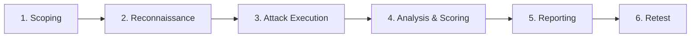

# AI Red Team Assessment Methodology

**Scope:** Enterprise engagement playbook | **Frameworks:** MITRE ATLAS, OWASP LLM Top 10 | **Posture:** Defender

A red team assessment without methodology is just unstructured poking. This page is
the **end-to-end playbook** for running a repeatable, defensible AI red team
engagement: scoping, reconnaissance, attack execution, scoring, and reporting. It
exists so that every engagement produces comparable, auditable findings that a
security org can act on — not a pile of anecdotes.

The methodology is framework-anchored. Every finding maps to a MITRE ATLAS
technique and an OWASP LLM category, and severity is expressed in a **CVSS-AI**
adaptation so business stakeholders can prioritize against their existing risk
register ([see framework crosswalk](../01_foundations/framework-crosswalk.md)).

---

## Phases



### 1. Scoping
Define targets, rules of engagement, data-handling rules, and success criteria.
Capture the system architecture: model(s), RAG corpus, tools/agents, trust
boundaries. Get written authorization. Agree on a kill switch and a cost ceiling
(denial-of-wallet testing can be expensive).

### 2. Reconnaissance
Enumerate the attack surface: input channels, retrieved content sources, tool
permissions, system-prompt exposure. Fingerprint the model and guardrails.
Map each surface to candidate ATLAS techniques.

### 3. Attack Execution
Run the campaign with the [red team harness](../../tools/red_team_harness/harness.py).
Cover prompt injection (direct + indirect), jailbreaks, RAG poisoning, agent
excessive-agency, and resource exhaustion. Record every payload, response, and
outcome for reproducibility.

### 4. Analysis & Scoring
Triage hits, dedupe, confirm exploitability, and score with CVSS-AI (below).
Use the [adversarial scorer](../../tools/eval_scorer/adversarial_scorer.py) for
attack-success-rate metrics.

### 5. Reporting
Produce an executive summary, technical findings, ATLAS/OWASP mappings, and
prioritized remediation tied to [defenses](../03_defenses/input-validation.md).

### 6. Retest
Validate fixes after the remediation window. Track regression.

---

## CVSS-AI Scoring Helper

Standard CVSS misses AI-specific dimensions, so we extend it with **model-impact**,
**autonomy**, and **reach** modifiers. The helper below computes a 0–10 score and a
qualitative band.

```python
from __future__ import annotations

from dataclasses import dataclass
from typing import Literal

Band = Literal["Low", "Medium", "High", "Critical"]


@dataclass
class CvssAiVector:
    exploitability: float   # 0..1  ease of triggering
    model_impact: float     # 0..1  safety/integrity damage
    autonomy: float         # 0..1  can the model act, not just speak?
    reach: float            # 0..1  blast radius / # affected principals


def score_cvss_ai(v: CvssAiVector) -> tuple[float, Band]:
    """Weighted AI-adapted severity score in [0, 10] with a band."""
    weighted = (
        0.30 * v.exploitability
        + 0.30 * v.model_impact
        + 0.20 * v.autonomy
        + 0.20 * v.reach
    )
    score = round(weighted * 10, 1)
    if score >= 9.0:
        band: Band = "Critical"
    elif score >= 7.0:
        band = "High"
    elif score >= 4.0:
        band = "Medium"
    else:
        band = "Low"
    return score, band


if __name__ == "__main__":
    indirect_injection = CvssAiVector(
        exploitability=0.9, model_impact=0.8, autonomy=0.7, reach=0.9
    )
    print(score_cvss_ai(indirect_injection))  # high/critical
```

---

## Timeline Template

| Day | Activity | Deliverable |
|-----|----------|-------------|
| 1 | Scoping + authorization | Rules of engagement |
| 2–3 | Reconnaissance | Attack surface map |
| 4–8 | Attack execution | Raw findings log |
| 9–10 | Analysis + CVSS-AI scoring | Scored finding set |
| 11–12 | Reporting | Final report + remediation plan |
| +30 | Retest | Regression report |

---

## Related

- Foundations: [Threat Modeling](../01_foundations/threat-modeling.md), [Framework Crosswalk](../01_foundations/framework-crosswalk.md)
- Enterprise: [Compliance Mapping](compliance-mapping.md), [Shift Left](shift-left.md)
- Tool: [../../tools/red_team_harness/harness.py](../../tools/red_team_harness/harness.py)
- Tool: [../../tools/report_generator/generate_report.py](../../tools/report_generator/generate_report.py)

## Further Reading

- [MITRE ATLAS](https://atlas.mitre.org)
- [OWASP LLM Top 10](https://owasp.org/www-project-top-10-for-large-language-model-applications/)
- [FIRST CVSS v4.0](https://www.first.org/cvss/)
