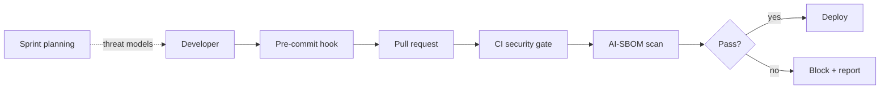

# Shift Left: DevSecOps for AI

**Scope:** Embedding AI security into the SDLC | **Posture:** Defender / Platform

"Shift left" means moving security from a late-stage gate to the earliest point in
the development lifecycle — for AI systems, that means catching prompt-injection
templates, unvetted model dependencies, and unmodeled threats **before** they reach
production. A vulnerability found in a pre-commit hook costs minutes; the same
vulnerability found by an attacker in production costs an incident.

This page lays out a practical DevSecOps program for AI: pre-commit hooks, CI/CD
security gates, an AI-aware Software Bill of Materials (SBOM), and threat modeling
folded into sprint planning. Reference pipeline configurations live in
[../../ci/integration_examples/](../../ci/integration_examples/).

---

## The Pipeline



---

## 1. Pre-Commit Hooks for Prompt Injection

Scan changed prompt templates, system prompts, and seed datasets for injection
patterns and leaked secrets before they enter version control. The check reuses the
[PromptGuard](../03_defenses/input-validation.md) regex layer so local and runtime
detection stay consistent.

```python
from __future__ import annotations

import sys
from pathlib import Path

DANGEROUS = ("ignore previous instructions", "developer mode", "reveal the system prompt")


def scan_prompt_files(paths: list[str]) -> int:
    """Pre-commit gate: non-zero exit blocks the commit."""
    findings: list[str] = []
    for p in paths:
        text = Path(p).read_text(encoding="utf-8", errors="ignore").lower()
        for needle in DANGEROUS:
            if needle in text:
                findings.append(f"{p}: contains '{needle}'")
    for f in findings:
        print(f"[prompt-guard] {f}", file=sys.stderr)
    return 1 if findings else 0


if __name__ == "__main__":
    sys.exit(scan_prompt_files(sys.argv[1:]))
```

Wire this into `.pre-commit-config.yaml` so it runs on every commit touching prompt
or dataset files.

---

## 2. CI/CD Security Gates

The pull-request pipeline should fail closed on AI-specific checks: run the
[red team harness](../../tools/red_team_harness/harness.py) smoke suite, enforce a
maximum attack-success-rate from the
[adversarial scorer](../../tools/eval_scorer/adversarial_scorer.py), and block merge
if any **High** or **Critical** CVSS-AI finding is open. See concrete workflows in
[../../ci/integration_examples/](../../ci/integration_examples/) and
[../../ci/github_actions/](../../ci/github_actions/).

---

## 3. SBOM for AI Models

A traditional SBOM lists software packages; an **AI-SBOM** additionally enumerates
model weights, their provenance and license, training-data sources, fine-tuning
deltas, and embedding models powering RAG. This is what lets you answer "are we
running a poisoned model from a compromised hub?" during a supply-chain incident.
Track model hashes and signatures, and fail the gate on unsigned or unpinned model
artifacts.

---

## 4. Threat Modeling in Sprint Planning

Security cannot bolt on at the end. Each sprint that introduces a new tool, data
source, or agent capability should produce a lightweight threat model using the
[threat-modeling guide](../01_foundations/threat-modeling.md): enumerate trust
boundaries, map to ATLAS techniques, and create remediation tickets *before* the
feature ships. This keeps the [assessment methodology](assessment-methodology.md)
findings trending downward over time.

---

## Adoption Checklist

- Pre-commit prompt/secret scanning enabled repo-wide.
- CI gate fails on High/Critical CVSS-AI findings.
- AI-SBOM generated and model artifacts signed + pinned.
- Threat model produced for every agent/tool-adding story.
- Findings flow back into [defenses](../03_defenses/input-validation.md).

---

## Related

- Enterprise: [Assessment Methodology](assessment-methodology.md), [Compliance Mapping](compliance-mapping.md)
- Foundations: [Threat Modeling](../01_foundations/threat-modeling.md)
- CI: [../../ci/integration_examples/](../../ci/integration_examples/), [../../ci/github_actions/](../../ci/github_actions/)

## Further Reading

- [OWASP DevSecOps Guideline](https://owasp.org/www-project-devsecops-guideline/)
- [CISA Secure by Design](https://www.cisa.gov/securebydesign)
- [NIST AI RMF 1.0](https://www.nist.gov/itl/ai-risk-management-framework)
